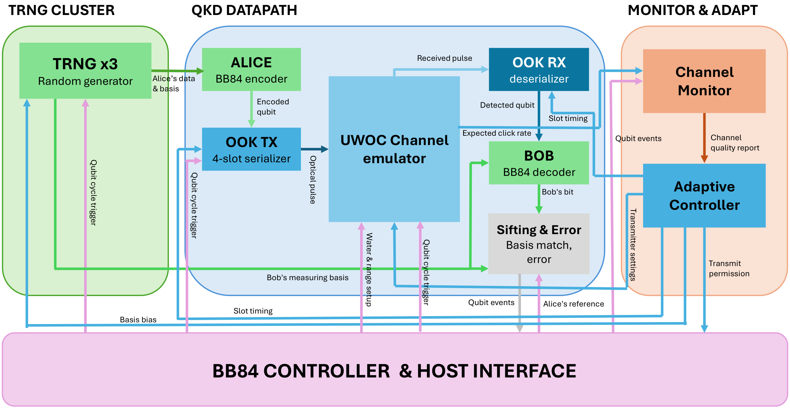
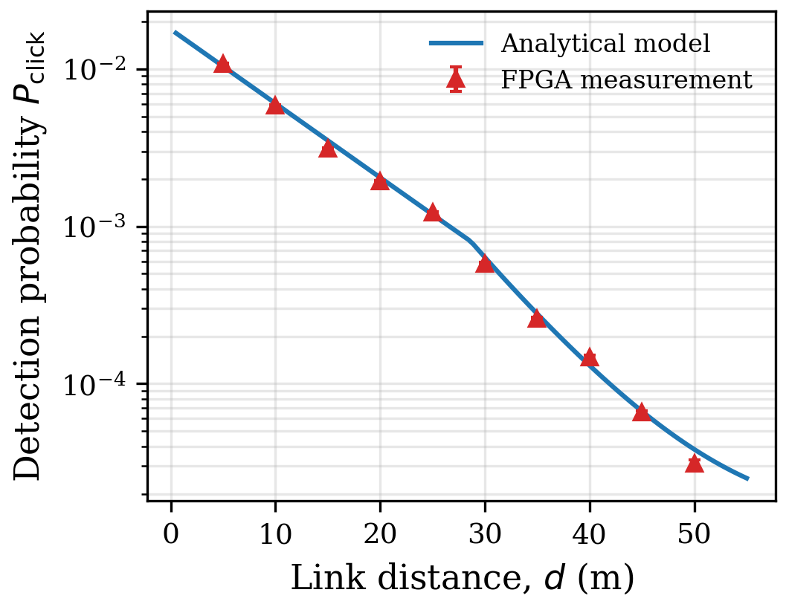
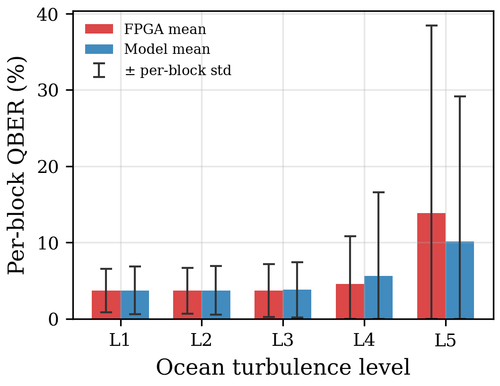
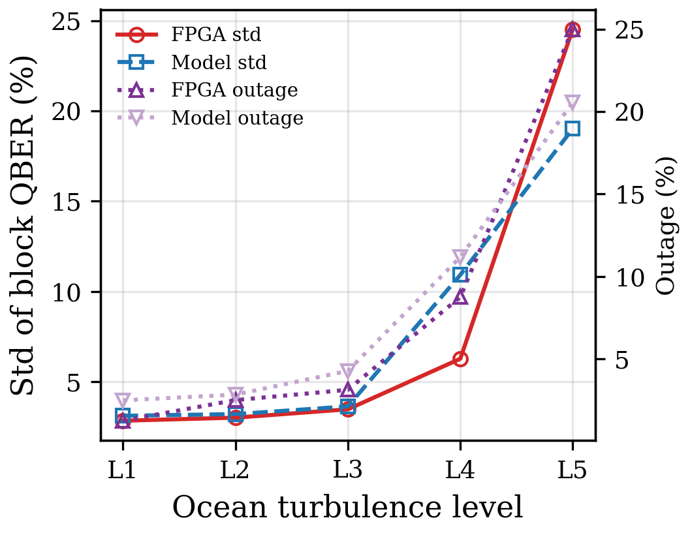
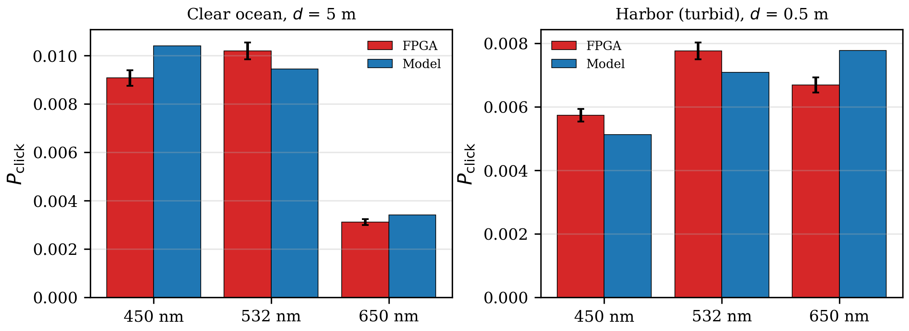
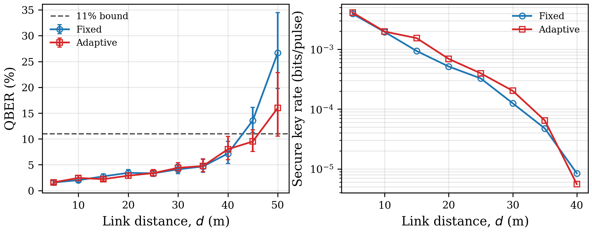

<div align="center">

# Single-FPGA BB84 QKD Testbed with a Synthesizable Underwater Optical Channel Emulator and Adaptive Controller

Real-time BB84 quantum key distribution over an **emulated underwater optical wireless (UWOC) channel**,
with an on-chip monitor and a closed-loop adaptive controller — all on one Altera Cyclone II device.

[](#5-hardware-platform)
[](#52-build-and-run)
[](#7-repository-layout)
[](#41-requirements)

</div>

---

## Abstract

This repository is the artifact of the paper *"Development of a Single-FPGA BB84 QKD Testbed with
Synthesizable Underwater Optical Channel Emulator and Adaptive Controller"* (HUST, project
**T2025-PC-068**).

A composite UWOC channel — deterministic path loss, scattering-induced fading, oceanic turbulence,
background counts and polarization error — is mapped into lookup tables and fixed-point RTL so that
click, loss and error events are generated **online, in hardware**, for every qubit attempt. An
on-chip monitor reports QBER, normalized click rate and block-to-block QBER variation over
2<sup>16</sup>-attempt windows to a four-mode adaptive controller that retunes optical intensity,
basis bias and emulated wavelength **without any host computation inside the feedback loop**.

A measurement campaign of **67 operating points / 4.21 × 10⁸ qubit attempts / ≈ 34 h** gives a pooled
measured-to-analytical detection ratio of **0.981**. Raising turbulence from L1 to L5 moves the pooled
QBER by only 0.4 percentage points, while the block-level QBER standard deviation grows **8.6×** and
the outage probability **19×** — the central result of the work.

> [!NOTE]
> **What is measured, and what is not.** The water channel is emulated in RTL. The campaign therefore
> validates *the FPGA implementation of the adopted channel model*, not the underwater physics itself.
> This is why every measured quantity in this README is printed next to its analytical counterpart.
> Validation against a physical underwater link is stated as future work in the paper.

---

## Table of Contents

1. [System architecture](#1-system-architecture)
2. [Channel and protocol model](#2-channel-and-protocol-model)
3. [Adaptive controller](#3-adaptive-controller)
4. [Getting started](#4-getting-started)
5. [Hardware platform](#5-hardware-platform)
6. [Results](#6-results)
7. [Repository layout](#7-repository-layout)
8. [Scope and known limitations](#8-scope-and-known-limitations)
9. [Citation and license](#9-citation-and-license)

---

## 1. System architecture

Alice's four-slot on–off-keying (OOK) frames cross the UWOC emulator to Bob; the sifting block feeds a
channel monitor, which drives the adaptive controller. The host paces qubit attempts and logs one
record per qubit over UART, and stays **outside** the control loop.



<div align="center"><sub><b>Figure 1</b> — Single-Cyclone II testbed: BB84 core, synthesizable UWOC channel
emulator, on-chip monitor, and closed-loop adaptive controller. Vector source:
<a href="Images/QKD_UWOC_Block.pdf"><code>Images/QKD_UWOC_Block.pdf</code></a>.</sub></div>

| Stage | Module | Role |
|---|---|---|
| Source | `trng.v`, `trng_random.v` | Ring-oscillator TRNG with Von Neumann debiasing |
| Alice | `alice.v`, `pwm_and_basis.v`, `ook_tx_serializer.v` | Basis/data selection, PWM intensity, 4-slot OOK framing |
| Channel | **`uwoc_channel.v`** + `uwoc_channel_rom.vh` | Fading sampling and photon-detection stage |
| Bob | `ook_rx_deserializer.v`, `bob.v`, `error_estimation.v` | Demodulation, sifting, error detection |
| Monitor | **`channel_monitor.v`** | Window QBER, normalized click rate, loss rate, QBER jitter |
| Control | **`adaptive_controller.v`** | 4-mode FSM + wavelength hill-climbing |
| Host I/O | `uart_rx.v`, `uart_tx.v`, `uart_reporter.v`, `top_module.v` | Command decode, 64-deep command FIFO, per-qubit reporting |

Each qubit is a two-bit symbol `q = {basis, data}` serialized into a SYNC/basis/data OOK frame. The
loss semantics follow the physics: **a lost photon silences the whole frame** (the receiver times out
and `evt_qubit_lost` is raised), whereas a **polarization error flips the data slot only**, because
depolarization mis-gates the detector *within* a basis rather than corrupting the frame.

---

## 2. Channel and protocol model

### 2.1 Composite channel

The instantaneous channel coefficient factors into a deterministic loss term and two independent
unit-mean fading terms:

```
h   = h_l(d, λ; w) · h_s · h_o ,            E[h_s] = E[h_o] = 1
h_l = min{ D_rx² / (π (d·tanθ_div)²), 1 } · exp( −F · c_w(λ) · d )
c_w = [ a_w(λ₀) + b_w(λ₀) ] · s_w(λ) ,      λ₀ = 532 nm
```

The unit-mean normalization makes `h_l` the mean channel, so `E[h] = h_l` is the analytical baseline
every measured point is scored against.

| Water type | a<sub>w</sub> + b<sub>w</sub> at 532 nm [m⁻¹] | c<sub>w</sub> [m⁻¹] | s<sub>w</sub> at (450, 532, 650) nm |
|---|---|---:|---|
| Clear ocean | 0.114 + 0.037 | 0.151 | (0.85, 1, 2.60) |
| Coastal | 0.179 + 0.219 | 0.398 | (1.10, 1, 1.45) |
| Harbor (Petzold) | 0.366 + 1.824 | 2.190 | (1.35, 1, 0.90) |

### 2.2 Fading statistics

* **Scattering** — `h_s ~ Gamma(1/σ_s², σ_s²)` in shape–scale form (unit mean), with
  `ln σ_s² = B_w (d − d_1,w)`. Over the measured ranges `σ_s² ≤ 0.055`, so scattering fading is a
  minor contributor beside turbulence.
* **Turbulence** — `h_o` is **log-normal** below a scintillation index of unity and **Weibull** above
  it, both of unit mean. The scintillation index `σ²_ho` follows from a plane-wave double integral
  over the Nikishov sea-water refractive-index spectrum, parameterized by (ε, χ_T, ω).

**Table 1 — Turbulence levels implemented in hardware** (σ²<sub>ho</sub> at the 20 m, 450 nm reference):

| Level | Regime | ε [m²/s³] | χ_T [K²/s] | ω | σ²<sub>ho</sub> | Branch |
|---|---|---:|---:|---:|---:|---|
| L0 | off | — | 0 | — | 0 | — |
| L1 | very weak | 10⁻² | 2.21 × 10⁻⁷ | −5 | 0.02 | log-normal |
| L2 | weak | 10⁻³ | 3.65 × 10⁻⁷ | −4 | 0.08 | log-normal |
| L3 | moderate | 10⁻⁴ | 5.29 × 10⁻⁷ | −3 | 0.30 | log-normal |
| L4 | strong | 10⁻⁵ | 5.91 × 10⁻⁷ | −2 | 1.00 | Weibull |
| L5 | severe | 10⁻⁶ | 3.85 × 10⁻⁷ | −1 | 3.00 | Weibull |

### 2.3 Detection, QBER and rate metric

```
n̄        = μ · h · η_det
P_click  = 1 − (1 − Y₀) · exp(−n̄)
QBER     = [ e_pol(d) · (1 − exp(−n̄)) + ½ Y₀ ] / P_click
e_pol(d) = min{ e₀ + k_s (1 − exp(−b_w(λ) d)), 0.5 }
R        = q · f_rep · P_click · max{ 0, 1 − 2 H₂(QBER) }
```

| Parameter | Value | Parameter | Value |
|---|---|---|---|
| μ (mean photon number) | 0.1 | e₀ / k_s | 0.01 / 0.04 |
| η_det | 0.18 | Dark / background counts | 60 Hz / 200 Hz |
| D_rx | 5.08 cm | Gate width → Y₀ | 50 ns → 1.3 × 10⁻⁵ |
| θ_div | 1 mrad | f_rep (enters `R` only) | 10 MHz |
| F (effective attenuation) | 0.85 | τ_coh → block length | 5 ms → 65 536 attempts |

A point is declared **secure** only when the one-sided **95 % Clopper–Pearson upper bound** on QBER
stays below the 11 % Shor–Preskill threshold — never the point estimate.

> [!IMPORTANT]
> `R` is the asymptotic Shor–Preskill rate for a **single-photon** source, evaluated on the measured
> gain. For the weak-coherent source used here it is a **rate metric, not a valid secret-key rate**:
> at μ = 0.1 without decoy states the correct bound is GLLP, which charges for the multi-photon
> fraction extractable by a photon-number-splitting (PNS) attack. See
> [§8](#8-scope-and-known-limitations).

### 2.4 Hardware realization

Equations above are realized in fixed-point arithmetic with **no divider anywhere in the datapath**.

| Aspect | Implementation |
|---|---|
| Inverse-CDF sampling | Two ROM banks, 256 entries each: 8 scattering classes (Gamma), 6 turbulence levels (log-normal/Weibull) |
| Fading combination | `h_f = min{ (h_s·h_o) >> 8, 2¹²−1 }` |
| Signal probability | `P_sig = min{ [(P̂·h_f) >> 8] · m >> 3, 2²⁴−1 }`, `P̂ = 1 − exp(−μ h_l η_det)` tabulated, `m` = 4-bit intensity level (`m = 8` ≙ nominal μ) |
| Detection / error | Comparisons against fresh 24-bit random words: `click = [r₁ < P_sig] ∨ [r₂ < Y₀]`; `error = [r₃ < e_pol]` on a signal click, `r₃[23]` (fair coin) on a background-only click |
| `h` precision | **12 bit**, 256 ≙ 1.0 — truncating to 8 bit collapses E[h] from 1.00 to 0.56, because the distribution tails fall below one LSB |
| Probability precision | **24 bit** — at 16 bit `P_sig` rounds to zero at long range and the link appears dead |
| Coherence sampling | `h_f` resampled by the **qubit-event counter**, held for 2<sup>k+5</sup> events, so a block contains a fixed number of attempts independently of host pacing |
| ROM footprint | Only the 144×24 `epol_rom` is inferred into M4K (2 blocks, 3 456 bits); the inverse-CDF and probability tables land in logic |

Linearizing `P_click` (scaling `P̂` by `h_f` instead of re-evaluating the exponential) departs from the
exact expectation by **< 0.3 %** across all operating points of the campaign.

The Python model exposes **8 numbered self-checks** (σ_s² fit, distribution inversion, σ²_ho
monotonicity, wavelength ordering, Monte-Carlo-vs-analytic agreement, window sizing, turbulence
observability). **FPGA ROMs are generated only from a model instance that passes them.**

---

## 3. Adaptive controller

The channel monitor accumulates statistics in counters as events arrive over windows of
2<sup>16</sup> = 65 536 attempts. A window is **accepted only when at least 16 sifted detections are
present** (`window_valid`); otherwise the controller holds its state. The click-rate indicator is
normalized to 128 at the nominal operating point, so the static path loss `exp(−c·d)` is divided out
and the controller observes only the fading margin. Turbulence is tracked as an EWMA of |ΔQBER|
between consecutive windows.

**Table 2 — Controller modes:**

| Mode | QBER | SNR (norm.) | Jitter | μ level | Basis p_z | Slot | Strategy |
|---|---:|---:|---:|---:|---:|---:|---|
| **Aggressive** | < 4 % | ≥ 160 | < 6 | 6/15 | 50 % | 5 ms | Maximum throughput |
| **Moderate** | < 8 % | ≥ 96 | — | 9/15 | 60 % | 10 ms | Balanced |
| **Conservative** | < 15 % | > 40 | ≥ 16 | 12/15 | 80 % | 50 ms | Maximum reliability |
| **Pause** | ≥ 15 % | ≤ 40 | — | — | — | — | Warning state |

* **Asymmetric hysteresis** — a downgrade follows one poor window (security first); an upgrade
  requires three consecutive acceptable windows.
* **Intensity is capped** at `MU_CAP = 12/15`. Raising μ lowers QBER but raises the multi-photon
  fraction, and the large underwater loss makes a PNS attack easier to hide, so intensity is bounded
  rather than maximized.
* **Wavelength hill-climbing** — a neighbouring λ is probed and accumulated over `LAM_ACC = 4` valid
  windows, and accepted only when its click count exceeds the incumbent by more than 1/16 (≈ 3σ).
  Averaging is what makes the decision possible at all: the true gap between adjacent wavelengths can
  be ~10 %, while a single 220-click window has ~6.7 % standard deviation.
* **Escape path** — if the climber lands on a λ that kills the link, `window_valid` would never
  reassert. At `stale = 2, 4, 6` the controller cycles through the remaining wavelengths before
  declaring the link lost.

The decision path contains **no processor, no operating system and no host interaction**: on the pulse
that closes a window the controller commits a new mode, intensity, basis probability and wavelength
within a fixed number of clock cycles, so control latency is bounded by construction.

### Three design decisions that came out of measurement

**(a) The monitoring window must be ~2¹⁶ attempts, not 256.** With `P_click ~ 10⁻³`, a 256-attempt
window collects 0.4 clicks on average; the per-window QBER is pure shot noise. Worse, that noise is
*anti-correlated* with the channel state — measured `std(QBER)` at weak turbulence (24.4 %) exceeded
that at severe turbulence (22.7 %) — so a controller would have moved in the wrong direction.
→ `channel_monitor.v`, model check 7.

**(b) Turbulence must be tracked through dispersion, not the mean.** See [§6.2](#62-turbulence-is-a-dispersion-effect).
→ `qber_jitter` (EWMA of |ΔQBER|), threshold at 16 units (±8 %), deliberately above the ~3–4 unit
shot-noise floor of that statistic; a first attempt at 6 caused spurious mode downgrades.

**(c) `loss_rate` cannot detect a dead link.** Because `P_click ~ 10⁻³` even on a healthy link,
`loss_rate` saturates at 255 permanently, so `loss_rate ≥ 250` is always true and once forced a
healthy 15 m clear-ocean link into `PAUSE`. Link death is now detected from **zero photon count** over
`DEAD_WINDOWS = 8` consecutive windows. → caught by `tb_adaptive_loop.v`, TEST C.

---

## 4. Getting started

### 4.1 Requirements

```bash
pip install numpy scipy matplotlib pyserial
```

`pyserial` is needed only for hardware measurement. The model, the tables and the figures run on
NumPy / SciPy / Matplotlib alone.

### 4.2 Software only — no board required

```bash
# Validate the physics model (8 self-checks); --plot exports verification figures
python python/uwoc_channel_model.py
python python/uwoc_channel_model.py --plot

# Fast parameter sweeps, fully in software
python python/bb84_uwoc_measure.py --simulate --scan distance
python python/bb84_uwoc_measure.py --simulate --scan turbulence
python python/bb84_uwoc_measure.py --simulate --scan wavelength
python python/bb84_uwoc_measure.py --simulate --scan mu

# Full analytical matrix → data/sim_table.csv
python python/sim_table.py --matrix
```

`--water {clear_ocean,coastal,harbor}`, `--turb 1..5`, `--lam {0,1,2}` (450/532/650 nm) and `--dist`
select the operating point. `sim_table.py --matrix` doubles as the planning tool: rows that differ
only in `outage` and `qber_win_std` while sharing `P_click`/`QBER` trace the same curve on hardware,
so measuring them buys nothing.

### 4.3 Verification pipeline

The project runs **model → ROM → RTL → measurement**, with a gate at each step.

```bash
# 1 ── Validate the physics model numerically
python python/uwoc_channel_model.py

# 2 ── Generate the FPGA ROMs from the validated model
python python/uwoc_lut_gen.py --verify            # → verilog/uwoc_channel_rom.vh

# 3 ── RTL channel vs the Python golden model
vlog +incdir+verilog verilog/uwoc_channel.v verilog/tb_uwoc_channel.v
vsim -c -do "run -all; quit" tb_uwoc_channel

# 4 ── Closed adaptive loop
vlog +incdir+verilog verilog/channel_monitor.v verilog/adaptive_controller.v verilog/tb_adaptive_loop.v
vsim -c -do "run -all; quit" tb_adaptive_loop

# 5 ── No qubit command dropped on a UART burst
vlog +incdir+verilog verilog/*.v
vsim -c -GN_CMD=32 -do "run -all; quit" tb_cmd_fifo

# 6 ── Score the campaign and redraw the paper artifacts
python python/check_vs_theory.py                  # per-point + pooled hypothesis tests
python python/check_adaptive_formula.py           # adaptive phase, scored at its own λ and μ
python python/sim_table.py                        # → data/sim_table.csv, compare_table.csv/.md, block_table.csv
python python/paper_figs_uwoc.py                  # → Images/fig_uwoc_*.png + table_uwoc_results.*
```

`sim_table.py` never opens the COM port — it only re-reads `data/` and recomputes the model, so it is
safe to run while a collection session is still going.

> [!IMPORTANT]
> **Parameter coupling.** `NEXP_LOG2` in `channel_monitor.v` must equal `log2(--window)` used by
> `uwoc_lut_gen.py` (both default to 16 ↔ 65 536). The `nexp_inv` ROM that normalizes SNR is generated
> for one specific window size; a mismatch silently rescales every SNR reading.

### 4.4 Running the measurement campaign

1. Open `verilog/top_module.qpf` in Quartus II 13.0, compile, program the DE1 board.
2. Set the DIP switches ([§5.3](#53-switch-configuration)); press `KEY[3]` to reset.
3. Collect:

```bash
# A standard publishable run
python python/fpga_collect.py --port COM9 --phase fixed --turb 3 --sections A --chunk 32

# Fast end-to-end dry run (scales target samples down to minutes)
python python/fpga_collect.py --port COM9 --phase fixed --scale 0.01

# Verify the chunk rate is safe on your board before a long run
python python/fpga_collect.py --port COM9 --chunk 32 --chunk-check

# Merge sidecar fpga_points.part*.csv left behind if the CSV was locked
python python/fpga_collect.py --merge
```

| Flag | Meaning |
|---|---|
| `--port COM9` | Serial port of the FPGA |
| `--phase fixed \| adaptive` | Fixed parameters, or closed-loop control (also flip `SW[1] = 1`) |
| `--turb 1..5` | Turbulence level for sections **A** and **D** (B sweeps L1…L5 by definition; C is fixed at L3) |
| `--sections A\|B\|C\|D` | **A** = range sweep, clear ocean · **B** = turbulence sweep at 25 m · **C** = wavelength × water type · **D** = range sweeps in coastal and harbor |
| `--chunk 32` | Queue 32 qubit commands back-to-back so the FPGA, not the COM-port timeout, is the rate limit. Clamped to 32: writing 64 into the 64-deep FIFO overflows on the first queueing excursion |
| `--coh 11` | Coherence-block length, 2<sup>k+5</sup> qubit events — see the warning below |

`fpga_collect.py` writes one CSV row per completed point, so an interrupted overnight run resumes
where it stopped.

> [!WARNING]
> **`--coh` decides whether the turbulence result exists at all.** At the legacy `--coh 0` the *pooled*
> QBER written to `fpga_points.csv` is turbulence-independent by construction — L1 and L5 come out
> identical — because pooling weights each block by its own click count and averages over ~10⁵ fading
> samples. With the default `--coh 11` (65 536 qubits) each block is one frozen fading sample, one
> block equals one monitor window, and `sim_table.py --blocks` recovers the per-block QBER, its spread
> and the outage probability. `--dyn-walk` is off by default for the same reason: the ±1 random walk of
> the level would make the independent variable of section B uncontrolled.

> [!WARNING]
> **`QBER = 0.00 %` means too few samples, not a clean channel.** At d = 5 m the model predicts
> QBER ≈ 1.64 %, so 93 sifted bits yield zero errors 21 % of the time. Budget `n_sift ≳ 1000`, i.e.
> `batch ≳ 1000 / (P_click · q_basis)`.

---

## 5. Hardware platform

### 5.1 Device and resources

| Item | Value | Resource | Used / available |
|---|---|---|---|
| FPGA | Altera Cyclone II **EP2C20F484C7** | Logic elements | 6 393 / 18 752 (**34 %**) |
| Board | Terasic DE1 | — combinational / registers | 6 198 / 1 379 |
| System clock | 50 MHz | 9-bit multipliers | 8 / 52 (15 %) |
| Host interface | RS-232, 115 200 baud, 8N1 | Memory bits | 7 104 / 239 616 (3 %) |
| Toolchain | Quartus II 13.0.1, `[v14]` build | Pins | 135 / 315 (43 %) |

Resource figures come from the fitter report in `verilog/output_files/`.

> [!WARNING]
> **The current build does not meet timing at 50 MHz as constrained** (slow-model Fmax **34.43 MHz**,
> worst setup slack **−9.047 ns**, TNS −26.698). Every failing path runs from `uwoc_channel`'s
> `h_s_reg`/`h_o_reg` through the 12×24 scaling multiply and the four probability comparators into
> `qubit_click`/`qubit_err`/`no_click` — 29.07 ns of data delay against a 20 ns period. Those
> destination registers are written only on `sample_pulse`, i.e. **once per qubit event (≥ 220 µs
> apart)**, and the `h` registers change only at a coherence-block boundary, so the logic has four
> orders of magnitude more settling time than TimeQuest grants it — consistent with the campaign
> reproducing the model to within 1.9 % pooled. This is a **reporting artefact of an incomplete SDC,
> not a validated closure**: the path needs a `set_multicycle_path` on the `sample_pulse`-enabled
> registers (or a pipeline stage in the decision datapath) before timing sign-off can be quoted.

`constraints/bb84_phase2.sdc` currently declares only the TRNG ring oscillators as false paths —
TimeQuest cannot distinguish a deliberate combinational loop from a design error:

```tcl
set_false_path -from [get_keepers {*trng_core*ro*_chain*}]
```

The SDC is already referenced from `top_module.qsf`, so a fresh compile picks it up.

### 5.2 Build and run

Quartus II 13.0 (Web Edition is sufficient) → open `verilog/top_module.qpf` → compile → program.
Pin assignments are in `de1_pins.tcl` and inlined in `top_module.qsf`.

### 5.3 Switch configuration

| Control | Function | Values |
|---|---|---|
| `SW[9]` | Input source | 0 = autonomous TRNG, 1 = PC-driven over UART |
| `SW[8]` | Bob basis | manual mode only |
| `SW[7:5]` | Turbulence level | 000 = off, 001 = very weak … 101 = severe |
| `SW[4]` | Channel enable | 0 = ideal bypass, 1 = UWOC emulator active |
| `SW[3:2]` | Water type | 00 = clear ocean, 01 = coastal, 10 = harbor |
| `SW[3]` / `SW[2]` | Alice basis / data | manual mode only (shares pins with water type) |
| `SW[1]` | Adaptive control | 0 = fixed parameters, 1 = adaptive |
| `SW[0]` | Run mode | 0 = automatic, 1 = manual step via `KEY[1]` |
| `KEY[3]` | Reset | resets all modules |
| `KEY[0]` | Eavesdropper | hold to simulate an intercept–resend attack |

`SW[3:2]` is latched as the water type at reset and reused as manual Alice basis/data afterwards. In
PC mode (`SW[9] = 1`) the channel configuration arrives over UART and the switches supply only the
reset defaults.

### 5.4 LED indicators

| Red LED | Meaning | Green LED | Meaning |
|---|---|---|---|
| `LEDR[1:0]` | TX qubit (basis, data) | `LEDG[1:0]` | Adaptive mode (00 AGG, 01 MOD, 10 CON, 11 PAUSE) |
| `LEDR[3:2]` | RX qubit | `LEDG[2]` | Transmission allowed |
| `LEDR[4]` | TX active | `LEDG[3]` | Channel emulator enabled |
| `LEDR[5]` | RX active | `LEDG[4]` | Photon lost (no click) |
| `LEDR[6]` | Signal detected | `LEDG[5]` | Window has enough samples |
| `LEDR[7]` | Basis match | `LEDG[6]` | Adaptive control enabled |
| `LEDR[8]` | Eavesdropper active | `LEDG[7]` | ⚠ Command FIFO overflowed |
| `LEDR[9]` | PC input mode | — | — |

**`LEDG[7]` is a data-validity flag**: it lights when the PC sent commands faster than the FPGA could
consume them, so that batch's `P_click` and sifted-bit count are artificially low. Reduce `--chunk`
and repeat the point.

### 5.5 UART protocol

**PC → FPGA**, one byte per command:

| Byte | Meaning |
|---|---|
| `1xxxxxxx` | Qubit command — bit[2] = Alice data, bit[1] = Alice basis, bit[0] = Bob basis |
| `0x01` | Reset statistics, flush the command FIFO |
| `0x02` | Request a status report |
| `0x30 \| dist[3:0]` | Set range index |
| `0x40 \| {water[1:0], lam[1:0]}` | Set water type and wavelength |
| `0x50 \| turb[2:0]` | Set turbulence level, held fixed |
| `0x58 \| turb[2:0]` | Same, with the ±1 random walk enabled |
| `0x60 \| coh[3:0]` | Coherence-block length |

**`0x60` — the coherence-block selector.** `coh = 0` keeps the legacy free-running clock timer
(2<sup>COH_LOG2</sup> cycles); `coh = k ≥ 1` freezes `h` for **2<sup>k+5</sup> qubit events** instead.
What the physics fixes is the dimensionless ratio `N_coh = τ_coh · f_rep` — 50 000 pulses per block. A
clock timer reproduces that only if qubits really arrive at `f_rep`; driven from the PC at
~3 500 qubit/s the board held `h` constant for 18 qubits, 2 726× too few, and every measurement window
averaged over ~10⁵ independent fading samples. `coh = 11` makes one fading sample equal one monitor
window (`NEXP_LOG2 = 16`).

**FPGA → PC**, one line per detected qubit (42 bytes, ≈ 3.65 ms at 115 200 baud):

```
@<a_data>,<a_basis>,<b_basis>,<bob_bit>,<basis_match>,<error>,<irradiance>,<total_hex>,<sifted_hex>,<errors_hex>,<mode>,<mu>,<lam>*\r\n
```

| Field | Width | Meaning |
|---|---|---|
| `a_data … error` | 1 dec each | Alice's bit and basis, Bob's basis and bit, basis match, error flag |
| `irradiance` | 3 dec | `h` on a 128 ≙ 1.0 scale, saturating at 255 (`h = 2.0`) |
| `total_hex` | 6 hex | **Attempt index** of this click since the last `0x01` |
| `sifted_hex`, `errors_hex` | 4 hex each | Running totals |
| `mode` | 1 dec | 0 = AGGRESSIVE, 1 = MODERATE, 2 = CONSERVATIVE, 3 = PAUSE |
| `mu` | 1 hex | Intensity level applied to *this* qubit (8 = nominal) |
| `lam` | 1 dec | 0 = 450, 1 = 532, 2 = 650 nm, as chosen by the controller |

`total_hex` is an **attempt index, not a click counter**: `attempt >> (coh + 5)` is the coherence block
the click belongs to, which is what makes per-block statistics reconstructible on the host. `mode`,
`mu` and `lam` are **appended**, so fields 0…9 keep their positions and older parsers still read a
current line correctly.

Qubits producing no click generate no line — the host detects them by timeout. The 64-deep command
FIFO in `top_module.v` absorbs UART bursts; without it, commands arriving 86.8 µs apart overwrote each
other while the FPGA needed ≥ 220 µs per qubit, executing only ~40 % of them and depressing measured
`P_click` by ~2.8×. `tb_cmd_fifo.v` regression-tests this.

---

## 6. Results

Campaign: **67 operating points, 4.21 × 10⁸ qubit attempts, ≈ 34 h** — 36 fixed + 31 adaptive, closed
2026-08-13 on the `[v14]` bitstream. Raw data in [`data/`](data/): one row per point in
`fpga_points.csv`, one line per click in `clicks_<tag>.csv`.

### 6.1 Emulator fidelity — the primary claim

Over the 36 fixed points the FPGA produced **184 217 detections against 187 707 predicted**, a pooled
ratio of **0.981**, with every individual point inside **[0.81, 1.13]** across two decades of
`P_click`. This test carries far more statistical weight than the QBER comparison, because `n_click`
exceeds `n_sift` by about 2× and each point spans 10⁶–10⁷ attempts.

Clear-ocean distance sweep (450 nm, L3, μ = 0.1), measurement against model on the same row:

| d [m] | P_click meas | P_click model | ratio | QBER | 95 % CI | R [bit/s] | Secure |
|---:|---:|---:|---:|---:|---:|---:|:--:|
| 5 | 1.078×10⁻² | 1.039×10⁻² | 1.037 | 1.56 % | [1.23, 1.94] | 39 227 | ✅ |
| 10 | 5.849×10⁻³ | 6.041×10⁻³ | 0.968 | 2.00 % | [1.63, 2.43] | 19 528 | ✅ |
| 15 | 3.114×10⁻³ | 3.511×10⁻³ | 0.887 | 2.74 % | [2.31, 3.23] | 9 376 | ✅ |
| 20 | 1.929×10⁻³ | 2.042×10⁻³ | 0.945 | 3.42 % | [2.88, 4.04] | 5 156 | ✅ |
| 25 | 1.218×10⁻³ | 1.189×10⁻³ | 1.024 | 3.33 % | [2.72, 4.04] | 3 266 | ✅ |
| 30 | 5.798×10⁻⁴ | 6.354×10⁻⁴ | 0.913 | 4.10 % | [3.27, 5.06] | 1 252 | ✅ |
| 35 | 2.595×10⁻⁴ | 2.781×10⁻⁴ | 0.933 | 4.67 % | [3.54, 6.02] | 476 | ✅ |
| 40 | 1.475×10⁻⁴ | 1.306×10⁻⁴ | 1.129 | 7.17 % | [5.23, 9.53] | 84 | ✅ |
| 45 | 6.560×10⁻⁵ | 6.686×10⁻⁵ | 0.981 | 13.58 % | [11.30, 16.13] | 0 | ❌ |
| 50 | 3.096×10⁻⁵ | 3.829×10⁻⁵ | 0.809 | 26.67 % | [19.78, 34.49] | 0 | ❌ |



**Maximum QBER-qualified range** (450 nm, L3, μ = 0.1):

| Water type | d<sub>max</sub> | QBER at d<sub>max</sub> | R | First rejected point |
|---|---:|---:|---:|---|
| Clear ocean | **40 m** | 7.17 % [5.23, 9.53] | 84 bit/s | 45 m — QBER 13.58 % |
| Coastal | **13 m** | 7.75 % [5.99, 9.83] | 72 bit/s | 16 m — QBER 20.00 % |
| Harbor | **1.5 m** | 6.00 % [4.85, 7.32] | 529 bit/s | 2 m — QBER 9.50 %, **bound 11.70 %** |

Harbor at 2 m shows why the *bound* and not the *estimate* is the criterion: 9.50 % is comfortably
under 11 %, but on 600 sifted bits the one-sided upper bound is 11.70 % and the point does not qualify.

### 6.2 Turbulence is a dispersion effect

Section B holds water, range and wavelength fixed at clear ocean / 25 m / 450 nm and sweeps L1…L5 over
160 × 65 536 ≈ 1.05 × 10⁷ attempts per level, with `--coh 11` so that each block is exactly one frozen
fading sample.

| Level | Pooled QBER | Block mean (FPGA) | Block mean (model) | Block std | Outage (block > 11 %) |
|---|---:|---:|---:|---:|---:|
| L1 very weak | 3.72 % | 3.71 % | 3.72 % | 2.84 % | 0.013 |
| L2 weak | 3.60 % | 3.68 % | 3.73 % | 3.01 % | 0.025 |
| L3 moderate | 3.74 % | 3.70 % | 3.81 % | 3.48 % | 0.031 |
| L4 strong | 3.91 % | 4.58 % | 5.66 % | 6.28 % | 0.088 |
| L5 severe | 3.49 % | **13.89 %** | 10.14 % | **24.53 %** | **0.250** |

The pooled column — total errors / total sifted bits, which is what a naive campaign reports — moves
by 0.4 percentage points and **not monotonically**. The block standard deviation moves by **8.6×** and
the outage probability by **19×**.

The reason is structural. In the loss-dominated regime `P_click ≈ n̄ ∝ h`, so the expectation cancels
the fading; and pooling weights every block by its own click count, so a deeply faded block
contributes almost nothing to the average that decides its own security. **A controller — or a paper —
watching only the pooled mean is blind to underwater turbulence.** The FPGA monitor therefore tracks
the EWMA of |ΔQBER| online and exports it to the controller.

The largest model–measurement gap is at L5 (block mean 13.89 % measured vs 10.14 % modelled), caused
by stronger fading and the resulting block-to-block fluctuation.




> [!IMPORTANT]
> **The measurement budget for a dispersion is in attempts, not sifted bits.** Stopping a point when it
> reaches N sifted bits is a rule correlated with the fading: a run that opens on a bright stretch hits
> its quota early and stops there, over-representing high-`h` blocks and biasing the spread
> *downwards*. The first pass at section B did exactly that — L5 reached 6 000 sifted bits in 129
> blocks where L1 needed 154, so the strongest turbulence got the smallest and most flattering sample.
> Section B now runs a fixed 160 × 65 536 attempts per level (`target_qubit` in `Link.run_point`).

### 6.3 Wavelength adaptation

The FPGA selects among three wavelength-dependent channel models rather than driving a physical
optical source. The analytical optimum and the controller's on-chip choice agree:

| Water, d | 450 nm | 532 nm | 650 nm | Predicted best | Controller's λ mix (450/532/650) |
|---|---:|---:|---:|:--:|:--|
| Clear ocean, 25 m | 1.189×10⁻³ | 7.401×10⁻⁴ | 1.729×10⁻⁵ | **450** | 450-dominant, 0 % red |
| Coastal, 8 m | 9.295×10⁻⁴ | 1.214×10⁻³ | 3.685×10⁻⁴ | **532** | 20 / **78** / 2 |
| Harbor, 1.5 m | 4.280×10⁻⁴ | 1.115×10⁻³ | 1.470×10⁻³ | **650** | 25 / 0 / **75** |

**The hill-climber recovers the water-dependent spectral ordering without ever being told the water
type.** Harbor at 1.5 m is the cleanest evidence in the campaign: λ alone is worth 3.44× there, and the
measured detection gain over the fixed phase is **3.08×** — far above what intensity alone can produce.

**The honest counter-example is one row below.** At harbor 2 m the optimum is still 650 nm (by 4.91×),
but the controller sat at **100 % 450 nm**: near the detection limit a candidate probe rarely clears
`window_valid` over `LAM_ACC` windows, so λ tracking is lost exactly where it would matter most. This
is a controller limitation and the first item to fix; the paper states adaptive probing duration as
future work.



<sub>**Diagnosing a stuck climber.** Under `[v14]`, 450/532 nm *mixing* at short range in clear ocean is
the hill-climber probing, not a fault. The failure signature is 650 nm taking a large share **in clear
ocean**, where it is ~27× worse at 15 m and ~92× worse at 25 m. `lambda_diagnosis()` in
`fpga_collect.py` separates a stuck probe from a command-FIFO overflow, which produce the same
low-`P_click` symptom: dropped commands scale `P_click` by a range-independent factor, whereas a wrong
λ scales it by `exp(−Δc·d)` and therefore lands exactly on another wavelength's model curve.</sub>

### 6.4 Fixed vs adaptive

Sections A, B and D were each run twice, `SW[1] = 0` and `SW[1] = 1` — 31 adaptive points against 36
fixed ones. Since `[v13]` every click line carries the mode, intensity level and wavelength in force
**for that qubit**, so the controller's behaviour is reconstructible from `data/clicks_adaptive_*.csv`
rather than inferred.

**Section A — clear ocean, L3:**

| d [m] | P_click fixed | P_click adaptive | gain | QBER fixed | QBER adaptive |
|---:|---:|---:|---:|---:|---:|
| 5 | 1.078×10⁻² | 1.139×10⁻² | 1.06× | 1.56 % | 1.58 % |
| 15 | 3.114×10⁻³ | 4.718×10⁻³ | 1.52× | 2.74 % | 2.20 % |
| 25 | 1.218×10⁻³ | 1.518×10⁻³ | 1.25× | 3.33 % | 3.37 % |
| 35 | 2.595×10⁻⁴ | 3.666×10⁻⁴ | 1.41× | 4.67 % | 4.75 % |
| 45 | 6.560×10⁻⁵ | 9.906×10⁻⁵ | 1.51× | 13.58 % | 9.51 % |

**Section D — coastal and harbor**, same distance grid and L3 as the fixed sweep. `λ mix` is the share
of clicks logged at 450/532/650 nm and `μ̄` the click-weighted mean intensity level. The fixed phase is
450 nm at μ-level 8 throughout by construction.

<details>
<summary><b>Coastal</b> (click to expand)</summary>

| d [m] | P_click fixed | P_click adaptive | gain | QBER fixed | QBER adaptive | λ mix | μ̄ |
|---:|---:|---:|---:|---:|---:|:--|---:|
| 2 | 7.986×10⁻³ | 9.944×10⁻³ | 1.25× | 2.72 % | 2.74 % | 47/53/0 | 9.0 |
| 4 | 4.067×10⁻³ | 5.240×10⁻³ | 1.29× | 3.54 % | 3.04 % | 39/61/0 | 9.0 |
| 6 | 2.027×10⁻³ | 2.511×10⁻³ | 1.24× | 4.50 % | 4.23 % | 31/64/5 | 9.9 |
| 8 | 9.007×10⁻⁴ | 1.398×10⁻³ | 1.55× | 5.40 % | 4.70 % | 20/78/2 | 10.7 |
| 10 | 4.615×10⁻⁴ | 6.022×10⁻⁴ | 1.30× | 5.95 % | 5.90 % | 99/1/0 | 11.3 |
| 13 | 1.506×10⁻⁴ | 2.325×10⁻⁴ | 1.54× | 7.75 % | 8.00 % | 100/0/0 | 11.9 |
| 16 | 5.967×10⁻⁵ | 8.477×10⁻⁵ | 1.42× | 20.00 % | 13.67 % | 100/0/0 | 11.9 |
| 19 | 2.501×10⁻⁵ | 3.502×10⁻⁵ | 1.40× | 22.67 % | 24.00 % | 100/0/0 | 11.8 |

</details>

<details>
<summary><b>Harbor</b> (click to expand)</summary>

| d [m] | P_click fixed | P_click adaptive | gain | QBER fixed | QBER adaptive | λ mix | μ̄ |
|---:|---:|---:|---:|---:|---:|:--|---:|
| 0.5 | 4.849×10⁻³ | 7.224×10⁻³ | 1.49× | 4.24 % | 3.52 % | 32/68/0 | 9.8 |
| 1.0 | 1.452×10⁻³ | 3.065×10⁻³ | 2.11× | 5.50 % | 4.92 % | 16/59/24 | 10.4 |
| 1.5 | 4.162×10⁻⁴ | 1.283×10⁻³ | **3.08×** | 6.00 % | 5.20 % | 25/0/**75** | 11.3 |
| 2.0 | 1.340×10⁻⁴ | 1.934×10⁻⁴ | 1.44× | 9.50 % | 9.83 % | 100/0/0 | 11.9 |
| 2.5 | 4.526×10⁻⁵ | 6.130×10⁻⁵ | 1.35× | 14.40 % | 16.00 % | 100/0/0 | 11.9 |
| 3.0 | 2.263×10⁻⁵ | 2.336×10⁻⁵ | 1.03× | 31.67 % | 28.33 % | 100/0/0 | 9.0 |
| 3.5 | 1.660×10⁻⁵ | 1.603×10⁻⁵ | 0.97× | 42.50 % | 45.00 % | 100/0/0 | 9.0 |

</details>



**Adaptation does not extend the QBER-qualified range in any water type.**

| Water | d<sub>max</sub> fixed | d<sub>max</sub> adaptive | First insecure point, adaptive |
|---|---:|---:|---|
| Clear ocean | 40 m | **40 m** | 45 m — QBER 9.51 %, bound 11.37 % |
| Coastal | 13 m | **13 m** | 16 m — QBER 13.67 %, bound 17.36 % |
| Harbor | 1.5 m | **1.5 m** | 2 m — QBER 9.83 %, bound 12.07 % |

Two of those three rows fail on **sample size**, not channel quality: the point estimate is already
under 11 % and only the bound is not. Closing them needs `n_sift ≈ 1240` at 45 m (measured 810) and
`≈ 2070` at harbor 2 m (measured 600) — roughly 25 × 10⁶ and 21 × 10⁶ attempts. Fix that target
**before** the run: extending a run until the bound happens to drop under 11 % is optional stopping and
invalidates the confidence level it is quoted at.

<sub>Mind which interval is which. Brackets in the section-A tables are the *two-sided* 95 %
Clopper–Pearson interval printed by `check_vs_theory.py`; the `bound` column is the *one-sided* 95 %
upper limit stored as `qber_hi` in `fpga_points.csv`, and only the latter is the security criterion. At
45 m adaptive they read 11.74 % and 11.37 % respectively.</sub>

### 6.5 Scoring the adaptive phase against the right model

`p_click_model` in `fpga_points.csv` is written by `model_expect()`
([`fpga_collect.py:468`](python/fpga_collect.py#L468)) at the λ the host requested and at the nominal
μ-level 8. That is the correct reference for the fixed phase and the **wrong** one for the adaptive
phase, where the controller owns both variables.

| Scoring of the 31 adaptive points | Pooled measured / predicted clicks |
|---|---:|
| At λ = 450 nm, μ-level 8 (the `p_click_model` column) | 1.284 |
| **At each click's logged λ and μ** | **0.987** |

Per point: mean 0.998, sd 0.049, range [0.897, 1.105] — the same band as the fixed phase's
[0.81, 1.13]. Pooled errors: 3 903 measured against 3 838 predicted (1.017). The entire 28 % excess is
λ and μ bookkeeping, leaving no residual for the controller or the RTL. Reproduce with
`python python/check_adaptive_formula.py`, which prints both scorings side by side.

### 6.6 Regenerating tables and figures

```bash
python python/sim_table.py          # → data/sim_table.csv, compare_table.csv/.md, block_table.csv
python python/paper_figs_uwoc.py    # → Images/fig_uwoc_*.png, table_uwoc_results.csv/.tex
```

Generated tables and figures are **snapshots**, only as new as the last run of those two scripts (both
regenerated 2026-08-13, covering all 67 points: three tables × 67 rows, 14 figures). Regenerate after
any further collection session — until you do, new points live in `fpga_points.csv` alone and silently
miss every table and figure here.

Full point table: [`data/fpga_points.csv`](data/fpga_points.csv) ·
Measurement-vs-model: [`data/compare_table.md`](data/compare_table.md) ·
Figures: [`Images/`](Images/)

---

## 7. Repository layout

```
├── verilog/
│   ├── top_module.qpf / .qsf     Quartus II project and settings
│   ├── top_module.v              Top level: BB84 FSM, UART decode, 64-deep command FIFO
│   ├── alice.v / bob.v           BB84 encoder / decoder
│   ├── error_estimation.v        Sifting and error detection
│   ├── trng.v / trng_random.v    Ring-oscillator TRNG (4 ROs + Von Neumann debiaser)
│   ├── ook_tx_serializer.v       OOK modulator, 4-slot framing
│   ├── ook_rx_deserializer.v     OOK demodulator, edge-triggered sync
│   ├── pwm_and_basis.v           PWM intensity control + biased basis selector
│   ├── uwoc_channel.v          ★ Underwater channel emulator
│   ├── uwoc_channel_rom.vh       ROM contents — GENERATED, never edit by hand
│   ├── channel_monitor.v       ★ Window QBER / SNR / jitter / loss estimator
│   ├── adaptive_controller.v   ★ 4-mode FSM + wavelength hill-climbing
│   ├── uart_rx.v / uart_tx.v     UART
│   ├── uart_reporter.v           Per-qubit and per-window packet formatter
│   ├── tb_uwoc_channel.v         TB: RTL channel vs Python golden model
│   ├── tb_adaptive_loop.v        TB: closed adaptive loop
│   ├── tb_cmd_fifo.v             TB: no qubit command dropped on a UART burst
│   └── gamma_gamma_final.v       Legacy atmospheric FSO channel (not instantiated)
│
├── constraints/
│   └── bb84_phase2.sdc           Timing constraints — false paths for the TRNG ring oscillators
│
├── python/
│   ├── uwoc_channel_model.py   ★ UWOC physics + 8 numerical self-checks
│   ├── uwoc_lut_gen.py         ★ Generates verilog/uwoc_channel_rom.vh
│   ├── bb84_uwoc_measure.py      Fast exploratory scans (hardware or --simulate)
│   ├── fpga_collect.py         ★ Long campaign, checkpointed to CSV
│   ├── check_vs_theory.py        Hypothesis tests: measurement vs model
│   ├── check_adaptive_formula.py Adaptive phase scored at its logged λ / μ
│   ├── sim_table.py            ★ Model matrix, measured-vs-model, per-block statistics
│   ├── paper_figs_uwoc.py        Paper figures + LaTeX table
│   └── Images/report/            Older analytic figure set, kept as-is
│
├── data/                         THE MEASUREMENT CAMPAIGN — written by fpga_collect.py
│   ├── fpga_points.csv           one row per point, 25 columns, tag = checkpoint key
│   ├── clicks_<tag>.csv          one row per click: attempt, bases, err, irrad, mode, mu, lam_idx
│   ├── sim_table.csv             generated by sim_table.py --matrix
│   ├── compare_table.csv / .md   generated by sim_table.py --compare
│   └── block_table.csv           generated by sim_table.py --blocks
│
├── Images/                       Paper figures (paper_figs_uwoc.py) + QKD_UWOC_Block.pdf
├── overleaf/UWOC_QKD/            LaTeX source of the paper
├── my paper/                     Submitted manuscript (PDF)
├── Paper/                        Reference papers the model is built from
├── de1_pins.tcl                  DE1 pin assignments (also inlined in top_module.qsf)
├── THUAT_NGU_VA_CONG_THUC.md     Vietnamese companion: terminology, formulas, how to read the CSVs
└── README.md
```

<sub>★ marks the files that carry the contribution. `uwoc_channel_model.py --plot` writes its
verification figures to `python/Images/`; the paper figure path is `paper_figs_uwoc.py` →
`Images/`.</sub>

---

## 8. Scope and known limitations

These are stated in the paper and repeated here so that no number in this README is quoted out of
context.

1. **Emulated, not physical.** The water channel is RTL. The campaign validates the hardware
   implementation of the adopted channel model; validation against a physical underwater optical link
   is future work.

2. **`R` is a rate metric, not a secret-key rate.** Equation `R = q f_rep P_click max{0, 1 − 2H₂(QBER)}`
   is the asymptotic Shor–Preskill rate for a single-photon source. At μ = 0.1 without decoy states
   the correct bound is GLLP, which charges for the multi-photon fraction. **A decoy-state treatment
   is required before any secure-key comparison.**

3. **The adaptive rate gain is largely intensity, and the rate formula does not charge for it.** The
   controller drives the intensity level from the nominal 8 up to a click-weighted mean of ~12 at long
   range, and `P_sig` is close to linear in that level — so raising μ *looks* like free key rate while
   it physically increases the multi-photon fraction. Any rate claim needs either a decoy-state bound
   or a μ-matched comparison. **The defensible adaptive result is λ selection** ([§6.3](#63-wavelength-adaptation)),
   which costs nothing in security.
   *(The per-click `mu` column is conditioned on a click having occurred, and high μ makes clicks
   likelier, so it is biased above the attempt-weighted intensity — do not quote it as "the intensity
   the controller used".)*

4. **`PAUSE` does not stop transmission in the configuration everything was measured in.**
   `tx_permitted` has one consumer, in the `else if` branch at `top_module.v:674`, guarded by
   `if (pc_input_mode)` one line above. Every published dataset was collected in PC mode
   (`SW[9] = 1`), where the FSM runs IDLE → WAIT_CMD → ENCODE and never tests it. The PAUSE arm of
   `adaptive_controller.v` then sets `power_level <= CON_POWER`, and `CON_POWER = MU_CAP = 12` — the
   *highest* intensity, not zero. So "94 % PAUSE" in `adaptive_D_coastal_d6` / `adaptive_D_harbor_d4`
   means *94 % of clicks arrived while the controller was in the PAUSE state and still transmitting at
   maximum intensity*: **a recorded warning state, not a security action.** Do not cite it as one until
   `tx_permitted` is wired into the PC-mode path and the affected points are re-measured.

5. **Do not pool datasets across bitstreams.** `clicks_fixed_A_dist_*` (except `d8`) were taken
   2026-08-08 on a build whose `mode`/`mu`/`lam_idx` columns are empty; the adaptive set and
   `fixed_A_dist_d8` are `[v14]`. Superseded local runs (`adaptive_v13_hong/`, `adaptive_chunk32_hong/`,
   `adapt_debug/`, …) came off a different instrument entirely — `lam_idx` pinned at 0, `mu` pinned at
   9 — are excluded by `.gitignore`, and must not be pooled with the current set.

6. **Timing is not signed off.** See the warning in [§5.1](#51-device-and-resources): the decision
   datapath is architecturally multicycle but analysed as single-cycle. `set_multicycle_path` (or a
   pipeline stage) is the outstanding item.

7. **Wavelength tracking is lost near the detection limit** ([§6.3](#63-wavelength-adaptation)) — an
   adaptive probing duration is required.

**Future work**, as stated in the paper: decoy-state BB84 with a GLLP-secure bound; adaptive wavelength
probing near the detection limit; finite-key analysis at the block sizes used by the monitor; and
validation against a physical underwater optical link.

---

## 9. Citation and license

Developed at the **Department of Communication Engineering, School of Electrical and Electronic
Engineering, Hanoi University of Science and Technology (HUST)**, under project **T2025-PC-068**.

Dao Dang Minh Hoang, Le Cong Khanh, Ha Duyen Hung, Duong Nam Khanh, and Ha Duyen Trung (corresponding
author).

```bibtex
@inproceedings{hoang2026uwocqkd,
  title     = {Development of a Single-FPGA BB84 QKD Testbed with Synthesizable
               Underwater Optical Channel Emulator and Adaptive Controller},
  author    = {Dao, Dang Minh Hoang and Le, Cong Khanh and Ha, Duyen Hung and
               Duong, Nam Khanh and Ha, Duyen Trung},
  booktitle = {Proc. RIVF Int. Conf. Computing and Communication Technologies},
  year      = {2026},
  note      = {HUST project T2025-PC-068}
}
```

### Key references

Bennett & Brassard, *Proc. IEEE ICCSSP*, 1984 ·
Shor & Preskill, *Phys. Rev. Lett.* **85**(2), 2000 ·
Gottesman, Lo, Lütkenhaus & Preskill, *Quantum Inf. Comput.* **4**(5), 2004 ·
Kaushal & Kaddoum, *IEEE Access* **4**, 2016 ·
Salcedo-Serrano *et al.*, *Opt. Express* **29**(23), 2021 ·
Nikishov & Nikishov, *Int. J. Fluid Mech. Res.* **27**(1), 2000 ·
Andrews & Phillips, *Laser Beam Propagation through Random Media*, 2nd ed., SPIE, 2005 ·
Oubei *et al.*, *Opt. Lett.* **42**(13), 2017 ·
Dong *et al.*, *Appl. Opt.* **61**(15), 2022 ·
Kebapci *et al.*, *IEEE Photon. J.* **15**(4), 2023 ·
Clopper & Pearson, *Biometrika* **26**(4), 1934.

Full bibliography in [`overleaf/UWOC_QKD/rivf_2026.tex`](overleaf/UWOC_QKD/rivf_2026.tex).

### License

No formal open-source license has been granted yet. Please contact the authors before commercial reuse
or redistribution. For academic and research use, please cite as above.
