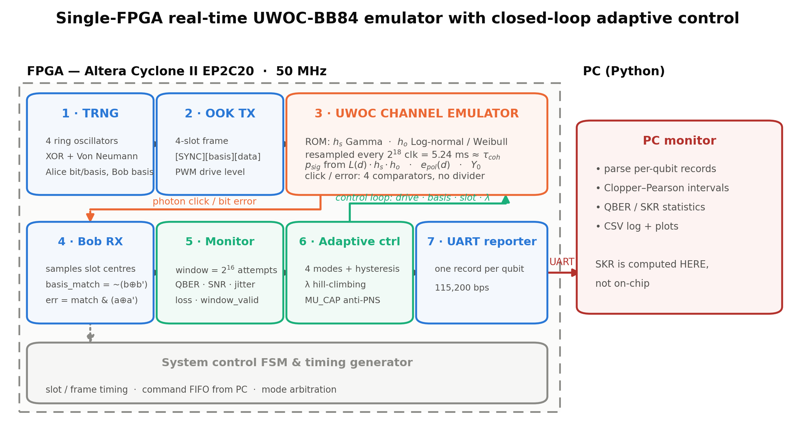
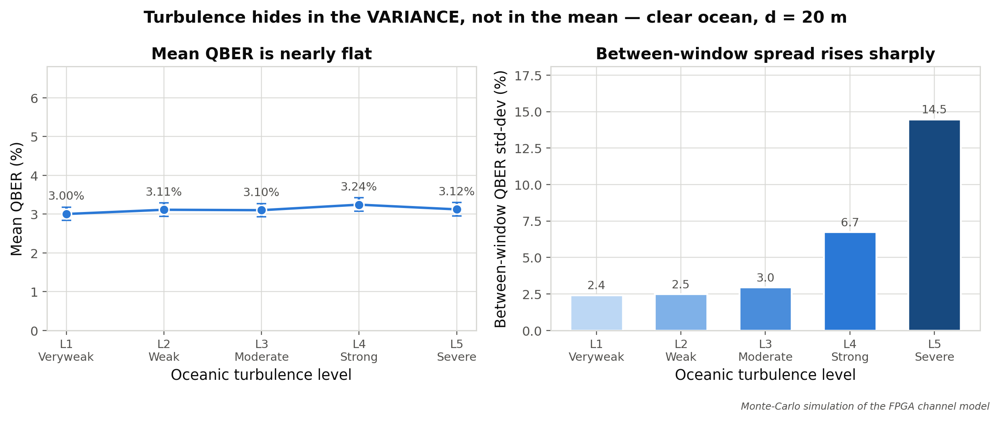

<div align="center">

# Adaptive BB84 QKD over an Underwater Optical Channel

**A single-FPGA, real-time emulator and closed-loop controller for discrete-variable QKD through water.**

[](#hardware)
[](#running-on-hardware)
[](#repository-layout)
[](#requirements)

</div>



---

## Table of Contents

- [Overview](#overview)
- [Key Results](#key-results)
- [Three Findings That Shaped the Design](#three-findings-that-shaped-the-design)
- [Physics Model](#physics-model)
- [Workflow](#workflow)
- [Adaptive Controller](#adaptive-controller)
- [UWOC Channel Emulator](#uwoc-channel-emulator)
- [Repository Layout](#repository-layout)
- [Getting Started](#getting-started)
- [Hardware Platform](#hardware-platform)
- [UART Protocol](#uart-protocol)
- [Timing Constraints](#timing-constraints)
- [Contributing](#contributing)
- [Citation](#citation)
- [License](#license)

---

## Overview

Underwater optical links are a fundamentally different regime from atmospheric free-space
optics: attenuation is three orders of magnitude higher, the dominant impairment is **photon
loss** rather than bit flips, and turbulence hides in the *variance* between observation
windows rather than in the mean error rate. Control policies tuned for atmospheric FSO do
not transfer.

This repository contains a complete hardware testbed for that regime:

- **A synthesizable UWOC channel emulator** (`uwoc_channel.v`) implementing composite
  fading `h = L(d,λ,water) · h_s · h_o` plus a photon-detection stage, driven by ROMs
  generated from a numerically validated physics model.
- **A closed-loop adaptive controller** (`adaptive_controller.v`) that retunes photon
  intensity, basis bias, slot width and **wavelength** in real time from on-chip channel
  telemetry.
- **A validated Python model** (`uwoc_channel_model.py`) that is both the source of the
  FPGA ROMs and the golden reference the RTL is checked against.

Everything runs on one Cyclone II device at 50 MHz — no optical hardware required to
exercise the full control loop.

> [!NOTE]
> **All performance numbers in this README are Monte-Carlo simulation results**, produced by
> `python/report_sim_figs.py` from the same channel model that populates the FPGA ROMs. They
> are not measurements taken on an optical bench. The measurement scripts
> (`bb84_uwoc_measure.py`, `fpga_collect.py`) support real hardware over UART and are
> documented below, but no hardware campaign data is included in this repository.

---

## Key Results

Monte-Carlo, 2×10⁶ pulses per point, moderate turbulence (L3), λ = 450 nm, μ = 0.1.
A point is called *secure* only when the **upper bound** of the Clopper–Pearson interval on
QBER stays below the 11 % BB84 limit.

| Water type | Max secure range | QBER at that range | SKR | First insecure range |
|---|---:|---:|---:|---:|
| Clear ocean | **40 m** | 9.46 % [8.42, 10.58] | 61 bps | 45 m (QBER 14.10 %) |
| Coastal | **10 m** | 5.97 % [5.16, 6.85] | 813 bps | 13 m (QBER 10.11 %) |
| Harbor (turbid) | **2 m** | 8.99 % [7.99, 10.07] | 84 bps | 2.5 m (QBER 17.47 %) |

Representative clear-ocean sweep:

| d [m] | P_click | QBER | 95 % CI | SKR [bps] | Outage | Secure |
|---:|---:|---:|---:|---:|---:|:--:|
| 5 | 1.05×10⁻² | 1.38 % | [1.16, 1.62] | 41 580 | 0.000 | ✅ |
| 15 | 3.62×10⁻³ | 3.07 % | [2.54, 3.69] | 11 000 | 0.000 | ✅ |
| 25 | 1.15×10⁻³ | 3.92 % | [3.23, 4.72] | 2 847 | 0.050 | ✅ |
| 35 | 2.79×10⁻⁴ | 5.23 % | [4.46, 6.10] | 559 | 0.204 | ✅ |
| 40 | 1.26×10⁻⁴ | 9.46 % | [8.42, 10.58] | 61 | 0.232 | ✅ |
| 45 | 6.40×10⁻⁵ | 14.10 % | [12.86, 15.40] | 0 | 0.202 | ❌ |

Full data: [`python/Images/report/sim_results_table.csv`](python/Images/report/sim_results_table.csv) ·
Figures: [`python/Images/report/`](python/Images/report/)

---

## Three Findings That Shaped the Design

Each of these is a quantitative result from the model that invalidated an
atmospheric-FSO design assumption. They are the reason the RTL looks the way it does.

### 1. The monitoring window must be ~2¹⁶ attempts, not 256

With `P_click ~ 10⁻³`, a 256-attempt window collects **0.4 clicks on average**. The
resulting per-window QBER is pure shot noise, and a controller reacting to it reacts to
nothing. Worse, the noise is *anti-correlated* with the real channel state: measured
`std(QBER)` at weak turbulence (24.4 %) exceeded that at severe turbulence (22.7 %), so the
controller would have moved in the wrong direction.

The window is now `2^ATTEMPT_LOG2` (default 2¹⁶ = 65 536) and every estimate is gated by
`window_valid`, asserted only when at least `MIN_SIFT = 16` sifted detections are present.

<sub>→ `channel_monitor.v` · reproduce with check 7 of `uwoc_channel_model.py`</sub>

### 2. Turbulence does not appear in the mean QBER

Across the five turbulence levels, mean QBER varies by ~70 % while the **between-window
standard deviation varies by 252 %**. The reason is structural: `P_click` is nearly linear
in `h`, so the expectation cancels the fading entirely. A controller watching only mean
QBER is blind to underwater turbulence.

The monitor therefore exports `qber_jitter`, an EWMA of `|ΔQBER|`, as the turbulence
indicator. Its threshold sits at 16 units (±8 %) — deliberately above the ~3–4 unit
shot-noise floor of that statistic, a first attempt at 6 caused spurious mode downgrades.

<sub>→ `channel_monitor.v`, `adaptive_controller.v` · check 8 · caught by `tb_adaptive_loop.v`</sub>



### 3. `loss_rate` cannot detect a dead link

Because `P_click ~ 10⁻³` even on a perfectly healthy link, `loss_rate` saturates at 255
permanently. The condition `loss_rate ≥ 250` is therefore *always true* and once forced a
healthy 15 m clear-ocean link into `PAUSE`. Link death is detected from **zero photon
count** over `DEAD_WINDOWS = 8` consecutive windows instead.

<sub>→ `adaptive_controller.v` · caught by `tb_adaptive_loop.v` TEST C</sub>

---

## Physics Model

```
h = L · h_s · h_o     L   = D_rx² / (π·(d·tanθ_div)²) · exp(−F·c(λ)·d)   [geometry + Beer-Lambert]
                      h_s ~ Gamma(1/σ_s², σ_s²)                          [scattering fading]
                      h_o ~ Lognormal (σ² < 1) / Weibull (σ² ≥ 1)        [oceanic turbulence]

n̄       = μ · L(d) · h · η_det
P_click = 1 − (1 − Y₀)·e^(−n̄)
QBER    = [ e_pol(d)·(1 − e^(−n̄)) + ½·Y₀ ] / P_click
e_pol   = min( e₀ + k_s·(1 − e^(−b(λ)·d)), 0.5 )
```

| Component | Treatment |
|---|---|
| Turbulence spectrum | Nikishov, parameterised by (ε, χ_T, w) |
| σ²_ho | Double integral over the spectrum — no closed form, evaluated offline |
| Scattering fading | Gamma, σ_s²(d) fitted to Table IV of Salcedo-Serrano et al. |
| Polarisation error | `e_pol(d)` from multiple scattering — the UWOC-specific QBER mechanism |
| Detection | μ, η_det, dark + background counts, gate window |
| Water types | Clear ocean, coastal, harbor (Petzold) |
| Wavelengths | 450 / 532 / 650 nm |
| Coherence time | τ_coh = 5 ms → fading frozen across ~50 000 pulses |

The model exposes **8 numbered self-checks** (7 of them pass/fail) covering the σ_s² fit,
the Weibull/Lognormal inversion, σ²_ho monotonicity, the wavelength conclusion, the
Monte-Carlo-vs-analytic agreement, window sizing, and where turbulence becomes observable.

```bash
python python/uwoc_channel_model.py            # run all checks
python python/uwoc_channel_model.py --plot     # + export verification figures
```

**References**
Kebapci et al., *IEEE Photonics J.* **15**(4), 2023 ·
Salcedo-Serrano et al., *IEEE ICC*, 2022 ·
Jamali, Akhoundi & Salehi, *IEEE TWC* **15**(6), 2016 ·
Nikishov & Nikishov, *Int. J. Fluid Mech. Res.* **27**, 2000 ·
Andrews & Phillips, *Laser Beam Propagation through Random Media*, 2nd ed.

---

## Workflow

The pipeline runs model → ROM → RTL → measurement, with a verification gate at each step.

```bash
# 1 ── Validate the physics model numerically
python python/uwoc_channel_model.py

# 2 ── Generate the FPGA ROMs from the validated model
python python/uwoc_lut_gen.py --verify              # → verilog/uwoc_channel_rom.vh

# 3 ── Check the RTL channel against the Python golden model
vlog +incdir+verilog verilog/uwoc_channel.v verilog/tb_uwoc_channel.v
vsim -c -do "run -all; quit" tb_uwoc_channel

# 4 ── Check the closed adaptive loop
vlog +incdir+verilog verilog/channel_monitor.v verilog/adaptive_controller.v \
                     verilog/tb_adaptive_loop.v
vsim -c -do "run -all; quit" tb_adaptive_loop

# 5 ── Check that a UART command burst drops no qubits
vlog +incdir+verilog verilog/*.v
vsim -c -GN_CMD=32 -do "run -all; quit" tb_cmd_fifo

# 6 ── Measure, in simulation or on hardware
python python/bb84_uwoc_measure.py --simulate --scan distance
python python/bb84_uwoc_measure.py --port COM28 --scan wavelength --batch 50000
```

> [!IMPORTANT]
> **Parameter coupling.** `NEXP_LOG2` in `channel_monitor.v` must equal `log2(--window)`
> used by `uwoc_lut_gen.py` (both default to 16 ↔ 65 536). The `nexp_inv` ROM that
> normalises SNR is generated for one specific window size; a mismatch silently rescales
> every SNR reading.

> [!WARNING]
> **`QBER = 0.00 %` means too few samples, not a clean channel.** At d = 5 m the model
> predicts QBER ≈ 1.64 %, so 93 sifted bits yield zero errors 21 % of the time. The
> measurement scripts report a one-sided Clopper–Pearson upper bound and call a point
> *secure* only when that bound is below 11 %. Budget `n_sift ≳ 1000`, i.e.
> `batch ≳ 1000 / (P_click · q_basis)`.

---

## Adaptive Controller

Four modes with asymmetric hysteresis. SNR is **normalised** — 128 equals the link's
nominal click rate — so the static path loss `exp(−c·d)` is divided out and the controller
observes only the fading margin.

| Mode | QBER | SNR (norm.) | Jitter | μ | Basis p_z | Slot | Strategy |
|---|---:|---:|---:|---:|---:|---:|---|
| **Aggressive** | < 4 % | ≥ 160 | < 6 | 6/15 | 50 % | 5 ms | Maximum throughput |
| **Moderate** | < 8 % | ≥ 96 | — | 9/15 | 60 % | 10 ms | Balanced |
| **Conservative** | < 15 % | > 40 | ≥ 16 | 12/15 | 80 % | 50 ms | Maximum reliability |
| **Pause** | ≥ 15 % | ≤ 40 | — | — | — | — | Suspend transmission |

- **Asymmetric hysteresis** — downgrade is immediate (security first); upgrade requires
  three consecutive good windows.
- **`window_valid` gate** — a window with fewer than 16 sifted detections carries no
  information, so the mode is *held* rather than changed.
- **μ capped at 12/15 (`MU_CAP`)** — raising μ lowers QBER but raises the multi-photon
  fraction. The enormous underwater loss makes a photon-number-splitting attack easier to
  hide, so intensity is bounded rather than maximised.
- **Wavelength hill-climbing** — probes a neighbouring λ, accumulates click counts over
  `LAM_ACC = 4` windows per measurement, and accepts a candidate only beyond a 1/16 margin
  (≈3σ). The true gap between adjacent wavelengths can be as small as ~10 %, while a single
  220-click window has ~6.7 % standard deviation — averaging is what makes the decision
  possible at all.
- **Escape path** — if the climber lands on a λ that kills the link, `window_valid` would
  never reassert and the FSM would deadlock. At `stale = 2, 4, 6` the controller cycles
  through the remaining wavelengths before declaring the link lost.

---

## UWOC Channel Emulator

Hardware realisation of `h = L · h_s · h_o` plus the detection stage, with no divider in
the datapath.

| Aspect | Implementation |
|---|---|
| Fading sampling | ROM-based inverse CDF, 256 points per distribution |
| Distributions | 8 scattering classes (Gamma) + 6 turbulence levels (Lognormal/Weibull) |
| `h` precision | 12-bit, 256 = 1.0 — 8-bit truncation collapses E[h] from 1.00 to 0.56 |
| Probability precision | 24-bit — at 16-bit, P_sig rounds to zero at long range |
| Coherence sampling | resampled every 2¹⁸ cycles ≈ 5.24 ms ≈ τ_coh, not per qubit |
| Decision stage | 4 comparators against `p_sig`, `p_noise`, `e_pol` — exactly equivalent to the QBER formula |
| ROM footprint | ≈ 52 kbit → 13 of 52 M4K blocks on EP2C20 |

**Loss semantics.** A no-click event silences the entire OOK frame, so the receiver times
out and the FSM raises `evt_qubit_lost` — faithful to "the photon never arrived". A
polarisation error flips **only the data slot**, leaving SYNC and basis slots intact,
because a polarisation error mis-gates the detector *within* a basis rather than corrupting
the frame.

---

## Repository Layout

```
├── verilog/
│   ├── top_module.qpf / .qsf   # Quartus II project + settings
│   ├── top_module.v            # Top level: BB84 FSM, UART decode, 64-deep command FIFO
│   ├── alice.v                 # BB84 encoder
│   ├── bob.v                   # BB84 decoder
│   ├── error_estimation.v      # Sifting and error detection
│   ├── trng.v                  # Ring-oscillator TRNG (4 ROs + Von Neumann debiaser)
│   ├── trng_random.v           # TRNG wrapper, drop-in replacement for an LFSR
│   ├── ook_tx_serializer.v     # OOK modulator, 4-slot framing
│   ├── ook_rx_deserializer.v   # OOK demodulator, edge-triggered sync
│   ├── pwm_and_basis.v         # PWM intensity control + biased basis selector
│   ├── uwoc_channel.v          # ★ Underwater channel emulator
│   ├── uwoc_channel_rom.vh     #   ROM contents — GENERATED, never edit by hand
│   ├── channel_monitor.v       # ★ Window QBER / SNR / jitter / loss estimator
│   ├── adaptive_controller.v   # ★ 4-mode FSM + wavelength hill-climbing
│   ├── uart_tx.v / uart_rx.v   # UART
│   ├── uart_reporter.v         # Per-qubit and per-window packet formatter
│   ├── tb_uwoc_channel.v       # TB: channel vs Python golden model
│   ├── tb_adaptive_loop.v      # TB: closed adaptive loop
│   ├── tb_cmd_fifo.v           # TB: no qubit command dropped on a UART burst
│   └── gamma_gamma_final.v     # Legacy atmospheric FSO channel (not instantiated)
│
├── constraints/
│   └── bb84_phase2.sdc         # Timing constraints — false paths for the TRNG ring oscillators
│
├── python/
│   ├── uwoc_channel_model.py   # ★ UWOC physics + numerical self-checks
│   ├── uwoc_lut_gen.py         # ★ Generates verilog/uwoc_channel_rom.vh
│   ├── bb84_uwoc_measure.py    # Measurement scans (hardware or simulation)
│   ├── fpga_collect.py         # Long-run hardware collection, checkpointed to CSV
│   ├── check_vs_theory.py      # Statistical tests: measurement vs model
│   ├── report_sim_figs.py      # Monte-Carlo figure set (source of this README's numbers)
│   ├── paper_figs_uwoc.py      # Publication figures from collected hardware data
│   ├── generate_report_figures.py, report_diagrams.py, make_report_pptx.py
│   └── Images/report/          # Generated figures + sim_results_table.csv
│
├── de1_pins.tcl                # DE1 pin assignments (also inlined in top_module.qsf)
└── README.md
```

<sub>★ = the four files that carry the contribution. Legacy atmospheric-FSO scripts
(`bb84_fpga_qber_snr_5_level.py`, `bb84_table2.py`, `bb84_timing.py`, `regen_paper_figs.py`)
remain in `python/` for reference.</sub>

---

## Getting Started

### Requirements

```bash
pip install numpy scipy matplotlib pyserial python-pptx
```

`pyserial` is only needed for hardware measurement; `python-pptx` only for the report
generator. Simulation needs just NumPy, SciPy and Matplotlib.

### Simulation Only — No Hardware

```bash
python python/uwoc_channel_model.py                        # validate the model
python python/bb84_uwoc_measure.py --simulate --scan distance
python python/bb84_uwoc_measure.py --simulate --scan turbulence
python python/bb84_uwoc_measure.py --simulate --scan wavelength
python python/bb84_uwoc_measure.py --simulate --scan mu
python python/report_sim_figs.py                           # regenerate every figure
```

### Running on Hardware

1. Open `verilog/top_module.qpf` in Quartus II 13.0, compile, and program the DE1 board.
2. Set the DIP switches (see below).
3. Press `KEY[3]` to reset, then run a scan:

```bash
python python/bb84_uwoc_measure.py --port COM28 --scan distance
python python/fpga_collect.py --port COM28 --phase fixed     # long, checkpointed run
python python/check_vs_theory.py                             # measurement vs model
```

`fpga_collect.py` writes one CSV row per completed point, so an interrupted overnight run
resumes where it stopped. Use `--scale 0.01` for a fast end-to-end dry run of the full
measurement matrix.

---

## Hardware Platform

| | |
|---|---|
| FPGA | Altera Cyclone II **EP2C20F484C7** |
| Board | Terasic DE1 |
| System clock | 50 MHz |
| Host interface | RS-232, 115 200 baud, 8N1 |

Synthesis figures reported by Quartus II 13.0 for the top-level project: **4 600 / 18 752
logic elements (24.5 %)**, **Fmax = 63.74 MHz**, setup slack **+4.312 ns**. The channel
emulator contributes two embedded multipliers and the monitor one more (a 16×16 product
replacing the SNR divider).

### Switch Configuration

| Control | Function | Values |
|---|---|---|
| `SW[9]` | Input source | 0 = autonomous TRNG, 1 = PC-driven over UART |
| `SW[8]` | Bob basis | manual mode only |
| `SW[7:5]` | Turbulence level | 000 = off, 001 = weak … 101 = severe |
| `SW[4]` | Channel enable | 0 = ideal bypass, 1 = UWOC emulator active |
| `SW[3:2]` | Water type | 00 = clear ocean, 01 = coastal, 10 = harbor |
| `SW[3]` | Alice basis | manual mode only (shares pins with water type) |
| `SW[2]` | Alice data | manual mode only |
| `SW[1]` | Adaptive control | 0 = fixed parameters, 1 = adaptive |
| `SW[0]` | Run mode | 0 = automatic, 1 = manual step via `KEY[1]` |
| `KEY[3]` | Reset | resets all modules |
| `KEY[0]` | Eavesdropper | hold to simulate an intercept–resend attack |

> `SW[3:2]` is latched as the water type at reset and reused as manual Alice basis/data
> afterwards. In PC mode (`SW[9] = 1`) the channel configuration is set over UART and the
> switches only supply the reset defaults.

### LED Indicators

| LED | Meaning | | LED | Meaning |
|---|---|---|---|---|
| `LEDR[1:0]` | TX qubit (basis, data) | | `LEDG[1:0]` | Adaptive mode (00 AGG, 01 MOD, 10 CON, 11 PAUSE) |
| `LEDR[3:2]` | RX qubit | | `LEDG[2]` | Transmission allowed |
| `LEDR[4]` | TX active | | `LEDG[3]` | Channel emulator enabled |
| `LEDR[5]` | RX active | | `LEDG[4]` | Photon lost (no click) |
| `LEDR[6]` | Signal detected | | `LEDG[5]` | Window has enough samples |
| `LEDR[7]` | Basis match | | `LEDG[6]` | Adaptive control enabled |
| `LEDR[8]` | Eavesdropper active | | `LEDG[7]` | ⚠ Command FIFO overflowed |
| `LEDR[9]` | PC input mode | | | |

**`LEDG[7]` is a data-validity flag.** It lights when the PC sent qubit commands faster than
the FPGA could consume them, meaning that batch's `P_click` and sifted-bit count are
artificially low. Reduce `--chunk` and repeat the measurement.

---

## UART Protocol

**PC → FPGA**, one byte per command:

| Byte | Meaning |
|---|---|
| `1xxxxxxx` | Qubit command — bit[2] = Alice data, bit[1] = Alice basis, bit[0] = Bob basis |
| `0x01` | Reset statistics and flush the command FIFO |
| `0x02` | Request a status report |
| `0x30 \| dist[3:0]` | Set the range index (0x30–0x3F) |
| `0x40 \| {water[1:0], lam[1:0]}` | Set water type and wavelength (0x40–0x4F) |
| `0x50 \| turb[2:0]` | Set the turbulence level (0x50–0x57) |

**FPGA → PC**, one line per detected qubit:

```
@<a_data>,<a_basis>,<b_basis>,<bob_bit>,<basis_match>,<error>,<irradiance>,<total_hex>,<sifted_hex>,<errors_hex>*\r\n
```

Qubits producing no click generate no line — the host detects them by timeout. A 64-deep
command FIFO in `top_module.v` absorbs UART bursts; without it, commands arriving 86.8 µs
apart overwrote each other while the FPGA needed ≥220 µs per qubit, executing only ~40 % of
them and depressing measured `P_click` by ~2.8×. `tb_cmd_fifo.v` regression-tests this.

---

## Timing Constraints

The TRNG relies on *intentional* combinational loops in its ring oscillators. TimeQuest
cannot distinguish a deliberate loop from a design error and reports bogus negative slack,
so `constraints/bb84_phase2.sdc` declares them false paths:

```tcl
set_false_path -from [get_keepers {*trng_core*ro*_chain*}]
```

Add the SDC to the Quartus project before trusting any timing report.

---

## Contributing

Contributions to this project are welcome! Whether it's reporting bugs, discussing improvements, or submitting pull requests, your input is highly valued.

1. Fork the repository.
2. Create your feature branch (`git checkout -b feature/AmazingFeature`).
3. Commit your changes (`git commit -m 'Add some AmazingFeature'`).
4. Push to the branch (`git push origin feature/AmazingFeature`).
5. Open a Pull Request.

---

## Citation

Developed at Hanoi University of Science and Technology (HUST) under project
**T2025-PC-068**.

```bibtex
@misc{uwoc_bb84_fpga,
  title  = {Adaptive BB84 QKD over an Underwater Optical Channel:
            An FPGA Emulator with Closed-Loop Parameter Control},
  note   = {HUST project T2025-PC-068},
  year   = {2026}
}
```

## License

No formal open-source license has been granted yet. Please contact the authors before commercial reuse or redistribution. For academic and research purposes, please ensure proper citation as described above.
</content>
