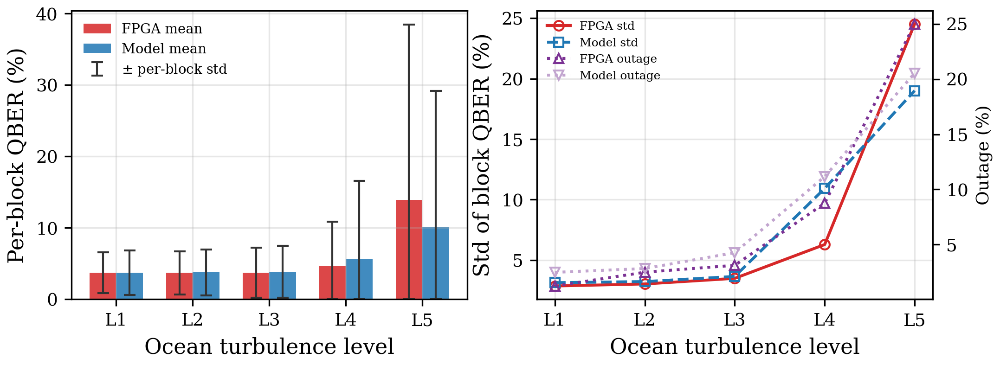

<div align="center">

# Adaptive BB84 QKD over an Underwater Optical Channel

**A single-FPGA, real-time emulator and closed-loop controller for discrete-variable QKD through water.**

[](#hardware)
[](#running-on-hardware)
[](#repository-layout)
[](#requirements)


---

## Table of Contents

- [Overview](#overview)
- [Key Results](#key-results)
- [Three Findings That Shaped the Design](#three-findings-that-shaped-the-design)
- [Physics Model](#physics-model)
- [Workflow](#workflow)
- [Adaptive Controller](#adaptive-controller)
- [UWOC Channel Emulator](#uwoc-channel-emulator)
- [Repository Layout](#repository-layout)
- [Getting Started](#getting-started)
- [Hardware Platform](#hardware-platform)
- [UART Protocol](#uart-protocol)
- [Timing Constraints](#timing-constraints)
- [Contributing](#contributing)
- [Citation](#citation)
- [License](#license)

---

## Overview

Underwater optical links are a fundamentally different regime from atmospheric free-space
optics: attenuation is three orders of magnitude higher, the dominant impairment is **photon
loss** rather than bit flips, and turbulence hides in the *variance* between observation
windows rather than in the mean error rate. Control policies tuned for atmospheric FSO do
not transfer.

This repository contains a complete hardware testbed for that regime:

- **A synthesizable UWOC channel emulator** (`uwoc_channel.v`) implementing composite
  fading `h = h_l(d,λ;w) · h_f`, `h_f = h_s · h_o`, plus a photon-detection stage, driven by ROMs
  generated from a numerically validated physics model.
- **A closed-loop adaptive controller** (`adaptive_controller.v`) that retunes photon
  intensity, basis bias, slot width and **wavelength** in real time from on-chip channel
  telemetry.
- **A validated Python model** (`uwoc_channel_model.py`) that is both the source of the
  FPGA ROMs and the golden reference the RTL is checked against.

Everything runs on one Cyclone II device at 50 MHz — no optical hardware required to
exercise the full control loop.

> [!NOTE]
> **The numbers in this README are measurements taken on the FPGA**, not model output.
> They were collected with `python/fpga_collect.py` over UART from a DE1 running the
> `[v14]` bitstream, and scored against the analytic model point by point with
> `python/sim_table.py`. The raw campaign is in [`data/`](data/): one row per measurement
> point in `fpga_points.csv`, one line per click in `clicks_<tag>.csv`.
>
> What they are *not* is an optical-bench experiment. The water channel is emulated in
> RTL, so the campaign measures **the hardware implementation of the physics**, not the
> physics itself — which is exactly why every measured quantity is printed next to its
> model value. The model alone can be reproduced with no board attached:
> `sim_table.py --matrix` and `bb84_uwoc_measure.py --simulate`.

---

## Key Results

Measured on hardware, fixed phase, moderate turbulence (L3), λ = 450 nm, μ = 0.1 nominal.
2.37×10⁸ qubit attempts over 36 points. The campaign closed on 2026-08-13 at **67 points /
4.21×10⁸ attempts / 34 h** once the 31-point adaptive phase is counted — that half is
reported separately under [Measured, fixed vs adaptive](#measured-fixed-vs-adaptive),
because it carries confounds this table does not. A point is called *secure* only when the
one-sided 95 % **Clopper–Pearson upper bound** on QBER stays below the 11 % BB84 limit —
never the point estimate.

| Water type | Max secure range | QBER at that range | SKR | First insecure range |
|---|---:|---:|---:|---:|
| Clear ocean | **40 m** | 7.17 % [5.23, 9.53] | 84 bps | 45 m (QBER 13.58 %) |
| Coastal | **13 m** | 7.75 % [5.99, 9.83] | 72 bps | 16 m (QBER 20.00 %) |
| Harbor (turbid) | **1.5 m** | 6.00 % [4.85, 7.32] | 529 bps | 2 m (QBER 9.50 %, bound 11.70 %) |

Harbor at 2 m is the case that shows why the bound is the criterion and not the estimate:
9.50 % is comfortably under 11 %, but on 600 sifted bits the upper bound is 11.70 % and the
point does not qualify.

The clear-ocean sweep, measurement against model on the same row:

| d [m] | P_click meas | P_click model | ratio | QBER | 95 % CI | SKR [bps] | Secure |
|---:|---:|---:|---:|---:|---:|---:|:--:|
| 5 | 1.078×10⁻² | 1.039×10⁻² | 1.037 | 1.56 % | [1.23, 1.94] | 39 227 | ✅ |
| 10 | 5.849×10⁻³ | 6.041×10⁻³ | 0.968 | 2.00 % | [1.63, 2.43] | 19 528 | ✅ |
| 15 | 3.114×10⁻³ | 3.511×10⁻³ | 0.887 | 2.74 % | [2.31, 3.23] | 9 376 | ✅ |
| 20 | 1.929×10⁻³ | 2.042×10⁻³ | 0.945 | 3.42 % | [2.88, 4.04] | 5 156 | ✅ |
| 25 | 1.218×10⁻³ | 1.189×10⁻³ | 1.024 | 3.33 % | [2.72, 4.04] | 3 266 | ✅ |
| 30 | 5.798×10⁻⁴ | 6.354×10⁻⁴ | 0.913 | 4.10 % | [3.27, 5.06] | 1 252 | ✅ |
| 35 | 2.595×10⁻⁴ | 2.781×10⁻⁴ | 0.933 | 4.67 % | [3.54, 6.02] | 476 | ✅ |
| 40 | 1.475×10⁻⁴ | 1.306×10⁻⁴ | 1.129 | 7.17 % | [5.23, 9.53] | 84 | ✅ |
| 45 | 6.560×10⁻⁵ | 6.686×10⁻⁵ | 0.981 | 13.58 % | [11.30, 16.13] | 0 | ❌ |
| 50 | 3.096×10⁻⁵ | 3.829×10⁻⁵ | 0.809 | 26.67 % | [19.78, 34.49] | 0 | ❌ |

**The `ratio` column is the actual claim of this repository.** Pooled over all 36 fixed
points the emulator produced 184 217 clicks against 187 707 expected — **0.981**, with every
individual point inside 0.81–1.13 across two decades of P_click. That test carries far more
statistical weight than the QBER comparison, because `n_click` exceeds `n_sift` by a factor
of two and each point spans 10⁶–10⁷ attempts.

Full data: [`data/fpga_points.csv`](data/fpga_points.csv) ·
Measurement-vs-model table: [`data/compare_table.md`](data/compare_table.md) ·
Figures: [`Images/`](Images/)

<sub>`compare_table.md` and the other generated tables are snapshots — they are only as new
as the last `python python/sim_table.py` run, and `Images/` only as new as the last
`paper_figs_uwoc.py` run. Both were regenerated on 2026-08-13 and now cover all 67 points
(three tables × 67 rows, 14 figures). Regenerate them after any further collection session:
until you do, new points live in `fpga_points.csv` alone and silently miss every table and
figure here.</sub>

---

## Three Findings That Shaped the Design

Each of these is a quantitative result — predicted by the model, and for #2 since confirmed
on hardware — that invalidated an atmospheric-FSO design assumption. They are the reason the
RTL looks the way it does.

### 1. The monitoring window must be ~2¹⁶ attempts, not 256

With `P_click ~ 10⁻³`, a 256-attempt window collects **0.4 clicks on average**. The
resulting per-window QBER is pure shot noise, and a controller reacting to it reacts to
nothing. Worse, the noise is *anti-correlated* with the real channel state: measured
`std(QBER)` at weak turbulence (24.4 %) exceeded that at severe turbulence (22.7 %), so the
controller would have moved in the wrong direction.

The window is now `2^ATTEMPT_LOG2` (default 2¹⁶ = 65 536) and every estimate is gated by
`window_valid`, asserted only when at least `MIN_SIFT = 16` sifted detections are present.

<sub>→ `channel_monitor.v` · reproduce with check 7 of `uwoc_channel_model.py`</sub>

### 2. Turbulence does not appear in the pooled QBER — only in the per-block spread

This was predicted by the model and then **measured**. Section B holds range, water and
wavelength fixed at 25 m / clear ocean / 450 nm and sweeps L1…L5, 1.05×10⁷ attempts per
level, with the coherence block set to 65 536 qubits (`--coh 11`) so that each block is
exactly one frozen fading sample:

| Level | Pooled QBER | Per-block mean QBER | Per-block std | Outage (block > 11 %) |
|---|---:|---:|---:|---:|
| L1 VERYWEAK | 3.72 % | 3.71 % | 2.84 % | 0.013 |
| L2 WEAK | 3.60 % | 3.68 % | 3.01 % | 0.025 |
| L3 MODERATE | 3.74 % | 3.70 % | 3.48 % | 0.031 |
| L4 STRONG | 3.91 % | 4.58 % | 6.28 % | 0.088 |
| L5 SEVERE | 3.49 % | 13.89 % | 24.53 % | 0.250 |

The pooled column — total errors / total sifted bits, which is what a naive campaign
reports — moves by 0.4 points and **not monotonically**. The per-block mean moves by a
factor of 3.7 and the outage by a factor of 19. The reason is structural: `P_click` is
nearly linear in `h`, so the expectation cancels the fading, *and* pooling weights each
block by its own click count, so a deeply faded block contributes almost nothing to the
average that decides its own security. A controller — or a paper — watching only the mean
is blind to underwater turbulence.

The monitor therefore exports `qber_jitter`, an EWMA of `|ΔQBER|`, as the turbulence
indicator. Its threshold sits at 16 units (±8 %) — deliberately above the ~3–4 unit
shot-noise floor of that statistic, a first attempt at 6 caused spurious mode downgrades.

<sub>→ `channel_monitor.v`, `adaptive_controller.v` · check 8 · caught by `tb_adaptive_loop.v` ·
reproduce with `python python/sim_table.py --blocks`</sub>



> [!IMPORTANT]
> **The measurement budget for a dispersion is in attempts, not sifted bits.** Stopping a
> point when it reaches N sifted bits is a rule correlated with the fading: a run that opens
> on a bright stretch hits its quota early and stops there, over-representing high-`h`
> blocks and biasing the spread *downwards*. The first pass at section B did exactly that —
> L5 reached 6 000 sifted bits in 129 blocks where L1 needed 154, so the strongest
> turbulence got the smallest and most flattering sample. Section B now runs a fixed
> 160 × 65 536 attempts per level (`target_qubit` in `Link.run_point`).

### 3. `loss_rate` cannot detect a dead link

Because `P_click ~ 10⁻³` even on a perfectly healthy link, `loss_rate` saturates at 255
permanently. The condition `loss_rate ≥ 250` is therefore *always true* and once forced a
healthy 15 m clear-ocean link into `PAUSE`. Link death is detected from **zero photon
count** over `DEAD_WINDOWS = 8` consecutive windows instead.

<sub>→ `adaptive_controller.v` · caught by `tb_adaptive_loop.v` TEST C</sub>

---

## Physics Model

```
h = L · h_s · h_o     L   = D_rx² / (π·(d·tanθ_div)²) · exp(−F·c(λ)·d)   [geometry + Beer-Lambert]
                      h_s ~ Gamma(1/σ_s², σ_s²)                          [scattering fading]
                      h_o ~ Lognormal (σ² < 1) / Weibull (σ² ≥ 1)        [oceanic turbulence]

n̄       = μ · L(d) · h · η_det
P_click = 1 − (1 − Y₀)·e^(−n̄)
QBER    = [ e_pol(d)·(1 − e^(−n̄)) + ½·Y₀ ] / P_click
e_pol   = min( e₀ + k_s·(1 − e^(−b(λ)·d)), 0.5 )
```

| Component | Treatment |
|---|---|
| Turbulence spectrum | Nikishov, parameterised by (ε, χ_T, w) |
| σ²_ho | Double integral over the spectrum — no closed form, evaluated offline |
| Scattering fading | Gamma, σ_s²(d) fitted to Table IV of Salcedo-Serrano et al. |
| Polarisation error | `e_pol(d)` from multiple scattering — the UWOC-specific QBER mechanism |
| Detection | μ, η_det, dark + background counts, gate window |
| Water types | Clear ocean, coastal, harbor (Petzold) |
| Wavelengths | 450 / 532 / 650 nm |
| Coherence time | τ_coh = 5 ms → fading frozen across ~50 000 pulses |

The model exposes **8 numbered self-checks** (7 of them pass/fail) covering the σ_s² fit,
the Weibull/Lognormal inversion, σ²_ho monotonicity, the wavelength conclusion, the
Monte-Carlo-vs-analytic agreement, window sizing, and where turbulence becomes observable.

```bash
python python/uwoc_channel_model.py            # run all checks
python python/uwoc_channel_model.py --plot     # + export verification figures
```

**References**
Kebapci et al., *IEEE Photonics J.* **15**(4), 2023 ·
Salcedo-Serrano et al., *IEEE ICC*, 2022 ·
Jamali, Akhoundi & Salehi, *IEEE TWC* **15**(6), 2016 ·
Nikishov & Nikishov, *Int. J. Fluid Mech. Res.* **27**, 2000 ·
Andrews & Phillips, *Laser Beam Propagation through Random Media*, 2nd ed.

---

## Workflow

The pipeline runs model → ROM → RTL → measurement, with a verification gate at each step.

```bash
# 1 ── Validate the physics model numerically
python python/uwoc_channel_model.py

# 2 ── Generate the FPGA ROMs from the validated model
python python/uwoc_lut_gen.py --verify              # → verilog/uwoc_channel_rom.vh

# 3 ── Check the RTL channel against the Python golden model
vlog +incdir+verilog verilog/uwoc_channel.v verilog/tb_uwoc_channel.v
vsim -c -do "run -all; quit" tb_uwoc_channel

# 4 ── Check the closed adaptive loop
vlog +incdir+verilog verilog/channel_monitor.v verilog/adaptive_controller.v \
                     verilog/tb_adaptive_loop.v
vsim -c -do "run -all; quit" tb_adaptive_loop

# 5 ── Check that a UART command burst drops no qubits
vlog +incdir+verilog verilog/*.v
vsim -c -GN_CMD=32 -do "run -all; quit" tb_cmd_fifo

# 6 ── Measure, in simulation or on hardware
python python/bb84_uwoc_measure.py --simulate --scan distance
python python/bb84_uwoc_measure.py --port COM28 --scan wavelength --batch 50000
python python/fpga_collect.py --port COM9 --phase fixed --turb 3   # the long campaign

# 7 ── Score the campaign against the model, then draw the paper figures
python python/check_vs_theory.py                    # per-point + pooled hypothesis tests
python python/check_adaptive_formula.py             # adaptive phase, scored at its own λ and μ
python python/sim_table.py                          # → data/sim_table.csv,
                                                    #   compare_table.csv/.md, block_table.csv
python python/paper_figs_uwoc.py                    # → Images/fig_uwoc_*.png + table_uwoc_results.*
```

`sim_table.py` never opens the COM port — it only re-reads `data/` and recomputes the model,
so it is safe to run while a collection session is still going. Its three tables answer three
different questions: `--matrix` is the full model sweep (and tells you which points are worth
measuring at all), `--compare` pairs every measured point with its model value, and
`--blocks` is the per-coherence-block statistic that separates the turbulence levels.

> [!IMPORTANT]
> **Parameter coupling.** `NEXP_LOG2` in `channel_monitor.v` must equal `log2(--window)`
> used by `uwoc_lut_gen.py` (both default to 16 ↔ 65 536). The `nexp_inv` ROM that
> normalises SNR is generated for one specific window size; a mismatch silently rescales
> every SNR reading.

> [!WARNING]
> **`QBER = 0.00 %` means too few samples, not a clean channel.** At d = 5 m the model
> predicts QBER ≈ 1.64 %, so 93 sifted bits yield zero errors 21 % of the time. The
> measurement scripts report a one-sided Clopper–Pearson upper bound and call a point
> *secure* only when that bound is below 11 %. Budget `n_sift ≳ 1000`, i.e.
> `batch ≳ 1000 / (P_click · q_basis)`.

---

## Adaptive Controller

Four modes with asymmetric hysteresis. SNR is **normalised** — 128 equals the link's
nominal click rate — so the static path loss `exp(−c·d)` is divided out and the controller
observes only the fading margin.

| Mode | QBER | SNR (norm.) | Jitter | μ | Basis p_z | Slot | Strategy |
|---|---:|---:|---:|---:|---:|---:|---|
| **Aggressive** | < 4 % | ≥ 160 | < 6 | 6/15 | 50 % | 5 ms | Maximum throughput |
| **Moderate** | < 8 % | ≥ 96 | — | 9/15 | 60 % | 10 ms | Balanced |
| **Conservative** | < 15 % | > 40 | ≥ 16 | 12/15 | 80 % | 50 ms | Maximum reliability |
| **Pause** | ≥ 15 % | ≤ 40 | — | — | — | — | Suspend transmission |

- **Asymmetric hysteresis** — downgrade is immediate (security first); upgrade requires
  three consecutive good windows.
- **`window_valid` gate** — a window with fewer than 16 sifted detections carries no
  information, so the mode is *held* rather than changed.
- **μ capped at 12/15 (`MU_CAP`)** — raising μ lowers QBER but raises the multi-photon
  fraction. The enormous underwater loss makes a photon-number-splitting attack easier to
  hide, so intensity is bounded rather than maximised.
- **Wavelength hill-climbing** — probes a neighbouring λ, accumulates click counts over
  `LAM_ACC = 4` windows per measurement, and accepts a candidate only beyond a 1/16 margin
  (≈3σ). The true gap between adjacent wavelengths can be as small as ~10 %, while a single
  220-click window has ~6.7 % standard deviation — averaging is what makes the decision
  possible at all.
- **Escape path** — if the climber lands on a λ that kills the link, `window_valid` would
  never reassert and the FSM would deadlock. At `stale = 2, 4, 6` the controller cycles
  through the remaining wavelengths before declaring the link lost.

### Measured, fixed vs adaptive

Sections A, B and D were each run twice, once with `SW[1] = 0` and once with `SW[1] = 1` —
31 adaptive points against the 36 fixed ones. Since the `[v13]` bitstream every click line
also carries the mode, the intensity level and the wavelength in force **for that qubit**,
so the controller's behaviour is reconstructible from `data/clicks_adaptive_*.csv` rather
than inferred. Section A first, at L3:

| d [m] | P_click fixed | P_click adaptive | gain | QBER fixed | QBER adaptive |
|---:|---:|---:|---:|---:|---:|
| 5 | 1.078×10⁻² | 1.139×10⁻² | 1.06× | 1.56 % | 1.58 % |
| 15 | 3.114×10⁻³ | 4.718×10⁻³ | 1.52× | 2.74 % | 2.20 % |
| 25 | 1.218×10⁻³ | 1.518×10⁻³ | 1.25× | 3.33 % | 3.37 % |
| 35 | 2.595×10⁻⁴ | 3.666×10⁻⁴ | 1.41× | 4.67 % | 4.75 % |
| 45 | 6.560×10⁻⁵ | 9.906×10⁻⁵ | 1.51× | 13.58 % [11.30, 16.13] | 9.51 % [7.57, 11.74] |

> [!WARNING]
> **Three confounds that must be stated with any of these numbers.**
>
> **1. The rate gain is mostly μ, and the SKR formula does not charge for it.** The per-click
> `mu` column shows the controller driving `active_power` from the nominal 8 up to a
> click-weighted mean of ~9.9 at 5 m and ~12.0 at 45 m, while the fixed phase sits at 8. With
> `p_sig = ((psig_ref·h_f)>>8)·mu_level>>3` the gain is close to linear in μ, and `skr()` is
> the plain decoy-free Shor–Preskill rate with **no PNS penalty** — so raising μ looks like
> free key rate when it physically increases the multi-photon fraction Eve can split. Any
> rate claim needs either a decoy-state bound or a μ-matched comparison. (That `mu` column is
> also conditioned on a click having happened, and high μ makes clicks likelier, so it is
> biased *above* the attempt-weighted intensity — do not quote it as "the intensity the
> controller used".) The defensible headline for the adaptive phase is **λ selection**,
> which costs nothing in security.
>
> **2. `PAUSE` does not stop transmission in the configuration everything was measured in.**
> `tx_permitted` has exactly one consumer, in the `else if` branch at `top_module.v:674`,
> guarded by `if (pc_input_mode)` one line above. Every published dataset was collected in
> PC mode (`SW[9] = 1`), where the FSM runs IDLE → WAIT_CMD → ENCODE and never tests it. The
> PAUSE arm of `adaptive_controller.v` then sets `power_level <= CON_POWER`, and
> `CON_POWER = MU_CAP = 12` — the *highest* intensity, not zero. The data shows it directly:
> `adaptive_D_coastal_d6` logs 633 clicks of which 93.8 % carry `mode = 3` at μ̄ = 11.9, and
> `adaptive_D_harbor_d4` 94.9 % of 513. So "94 % PAUSE" means *94 % of clicks arrived while
> the controller was in the PAUSE state and still transmitting at maximum intensity* — a
> recorded warning state, not a security action. Do not cite it as one until `tx_permitted`
> is wired into the PC-mode path and the affected points are re-measured.
>
> **3. The two phases were measured under different bitstreams.** `clicks_fixed_A_dist_*`
> apart from `d8` were taken on 2026-08-08 with a build whose `mode`/`mu`/`lam_idx` columns
> are empty; the adaptive set and `fixed_A_dist_d8` are `[v14]`. Older adaptive data under
> `data/adaptive_v13_hong/`, `data/adaptive_chunk32_hong/` and `data/adapt_debug/` came off a
> different instrument entirely — `lam_idx` pinned at 0 and `mu` pinned at 9 — and must not
> be pooled with the current set.

#### Section D — the same comparison in coastal and harbor water

Coastal and harbor were re-run adaptively on 2026-08-10…13 over the same distance grid and
the same L3 turbulence as the fixed sweep. `λ mix` is the share of clicks logged at
450/532/650 nm and `μ̄` the click-weighted mean intensity level — both read out of
`clicks_adaptive_D_*.csv`, both subject to the click-conditioning bias noted above. The
fixed phase is 450 nm at μ = 8 throughout by construction.

**Coastal**

| d [m] | P_click fixed | P_click adaptive | gain | QBER fixed | QBER adaptive | λ mix adaptive | μ̄ |
|---:|---:|---:|---:|---:|---:|:--|---:|
| 2 | 7.986×10⁻³ | 9.944×10⁻³ | 1.25× | 2.72 % | 2.74 % | 47/53/0 | 9.0 |
| 4 | 4.067×10⁻³ | 5.240×10⁻³ | 1.29× | 3.54 % | 3.04 % | 39/61/0 | 9.0 |
| 6 | 2.027×10⁻³ | 2.511×10⁻³ | 1.24× | 4.50 % | 4.23 % | 31/64/5 | 9.9 |
| 8 | 9.007×10⁻⁴ | 1.398×10⁻³ | 1.55× | 5.40 % | 4.70 % | 20/78/2 | 10.7 |
| 10 | 4.615×10⁻⁴ | 6.022×10⁻⁴ | 1.30× | 5.95 % | 5.90 % | 99/1/0 | 11.3 |
| 13 | 1.506×10⁻⁴ | 2.325×10⁻⁴ | 1.54× | 7.75 % | 8.00 % | 100/0/0 | 11.9 |
| 16 | 5.967×10⁻⁵ | 8.477×10⁻⁵ | 1.42× | 20.00 % | 13.67 % | 100/0/0 | 11.9 |
| 19 | 2.501×10⁻⁵ | 3.502×10⁻⁵ | 1.40× | 22.67 % | 24.00 % | 100/0/0 | 11.8 |

**Harbor**

| d [m] | P_click fixed | P_click adaptive | gain | QBER fixed | QBER adaptive | λ mix adaptive | μ̄ |
|---:|---:|---:|---:|---:|---:|:--|---:|
| 0.5 | 4.849×10⁻³ | 7.224×10⁻³ | 1.49× | 4.24 % | 3.52 % | 32/68/0 | 9.8 |
| 1.0 | 1.452×10⁻³ | 3.065×10⁻³ | 2.11× | 5.50 % | 4.92 % | 16/59/24 | 10.4 |
| 1.5 | 4.162×10⁻⁴ | 1.283×10⁻³ | **3.08×** | 6.00 % | 5.20 % | 25/0/**75** | 11.3 |
| 2.0 | 1.340×10⁻⁴ | 1.934×10⁻⁴ | 1.44× | 9.50 % | 9.83 % | 100/0/0 | 11.9 |
| 2.5 | 4.526×10⁻⁵ | 6.130×10⁻⁵ | 1.35× | 14.40 % | 16.00 % | 100/0/0 | 11.9 |
| 3.0 | 2.263×10⁻⁵ | 2.336×10⁻⁵ | 1.03× | 31.67 % | 28.33 % | 100/0/0 | 9.0 |
| 3.5 | 1.660×10⁻⁵ | 1.603×10⁻⁵ | 0.97× | 42.50 % | 45.00 % | 100/0/0 | 9.0 |

<sub>`clicks_adaptive_D_coastal_d0_L5.csv` is a 31st point off the grid — coastal 2 m repeated
at L5, the only place turbulence is varied inside section D. It is worth one line: P_click
barely moves (9.944×10⁻³ at L3 vs 1.002×10⁻² at L5) while μ̄ goes 9.0 → 9.7 and the λ mix
swings 47/53/0 → 77/23/0, so the controller answers turbulence with intensity rather than
colour. Nothing else reads it — `pick()` at `paper_figs_uwoc.py:99` filters on phase and the
section-D figure takes the fixed phase only — so it never contaminates a distance sweep.</sub>

**The controller does not extend the secure range in any water type.** The criterion is the
same Clopper–Pearson bound used everywhere in this README:

| Water | d_max fixed | d_max adaptive | first insecure point, adaptive |
|---|---:|---:|---|
| Clear ocean | 40 m | **40 m** | 45 m — QBER 9.51 %, bound 11.37 % |
| Coastal | 13 m | **13 m** | 16 m — QBER 13.67 %, bound 17.36 % |
| Harbor | 1.5 m | **1.5 m** | 2 m — QBER 9.83 %, bound 12.07 % |

Two of those three rows fail on *sample size*, not on channel quality: the point estimate is
already under 11 % and only the bound is not. Closing them needs n_sift ≈ 1240 at 45 m
(measured 810) and ≈ 2070 at harbor 2 m (measured 600), i.e. roughly 25×10⁶ and 21×10⁶
attempts. Fix that target **before** the run — extending a run until the bound happens to
drop under 11 % is optional stopping and invalidates the confidence level it is quoted at.

<sub>Mind which interval is which. The brackets in the section-A table are the *two-sided*
95 % CP interval printed by `check_vs_theory.py`; the `bound` column above is the *one-sided*
95 % upper limit stored as `qber_hi` in `fpga_points.csv`, which is what `secure` is computed
from. At 45 m adaptive they read 11.74 % and 11.37 % respectively, and only the second one is
the criterion.</sub>

#### Scoring the adaptive phase against the right model

`p_click_model` in `fpga_points.csv` is written by `model_expect()`
([fpga_collect.py:468](python/fpga_collect.py#L468)) at the λ the host asked for and at
the nominal μ = 8. That is the correct model for the fixed phase and the wrong one for the
adaptive phase, where the controller owns both. Scored that way the 31 adaptive points come
out at **1.284×** — which reads as "the emulator is 28 % off" when nothing is off.

Scored against the model they actually obey — per-click `mu` and `lam_idx`, with the
attempt shares recovered by inverting the click conditioning — the same points give:

| Scoring | pooled measured / predicted clicks |
|---|---:|
| At λ = 450, μ = 8 (the `p_click_model` column) | 1.284 |
| **At each click's logged λ and μ** | **0.987** |

Per point: mean 0.998, sd 0.049, range [0.897, 1.105] — the same band as the fixed phase's
0.81–1.13. Pooled errors: 3903 measured against 3838 predicted, 1.017. So the whole 28 %
excess is λ and μ bookkeeping, with no residual left for the controller or the RTL. Run
`python python/check_adaptive_formula.py` to reproduce; it prints both scorings side by
side. Note the test is blind to `tx_permitted` — gated attempts would leave numerator and
denominator together — so it is consistent with the PAUSE finding above, not proof of it.

#### What the λ column actually shows

This is the one adaptive result the μ confound does not touch. Model `P_click` at L3, best
wavelength against 450 nm:

| Water, d | 450 nm | 532 nm | 650 nm | best | vs 450 |
|---|---:|---:|---:|---:|---:|
| clear ocean, 25 m | 1.189×10⁻³ | 7.401×10⁻⁴ | 1.729×10⁻⁵ | 450 | 1.00× |
| coastal, 8 m | 9.295×10⁻⁴ | 1.214×10⁻³ | 3.685×10⁻⁴ | 532 | 1.31× |
| harbor, 1.5 m | 4.280×10⁻⁴ | 1.115×10⁻³ | 1.470×10⁻³ | 650 | **3.44×** |

The measured λ mix follows that ordering without ever being told the water type: 450-dominant
with 0 % red in clear ocean, 532-dominant in coastal, and 75 % **650 nm** at harbor 1.5 m.
That last point is the cleanest evidence in the campaign. λ alone is worth 3.44× there and
μ̄ = 11.3 a further ~1.41×, yet the measured gain is 3.08× — *below their product*, and far
above what intensity can produce on its own. Contrast section A at 45 m, where the measured
1.51× sits on top of the μ ratio 12/8 = 1.50× and leaves nothing for λ to explain.

The honest counter-example is one row below. At harbor 2 m the optimum is 650 nm by 4.91×,
and the controller sat at **100 % 450 nm** with μ pinned at 11.9 — measured gain 1.44×,
which is the μ ratio and nothing else. The climber loses λ tracking exactly where the link
is marginal, because a candidate probe there rarely clears `window_valid` over `LAM_ACC`
windows. That is a controller limitation, not a data problem, and it is the first thing to
fix before any claim that adaptation extends range.

Under `[v14]` a healthy clear-ocean run shows 450/532 nm **mixing** at short range: that is
the hill-climber probing, not a fault. The failure signature to watch for is 650 nm taking a
large share **in clear ocean**, where it is ~27× worse at 15 m and ~92× worse at 25 m; in
the current dataset its share is ~0 %. Read that signature per water type: the same 650 nm
share is the *correct* answer in harbor, where it is 3.4× better at 1.5 m, and section D
above is what separates the two cases. `lambda_diagnosis()` in `fpga_collect.py` separates a
stuck probe from a command-FIFO overflow, which produce the same low-`P_click` symptom —
dropped commands scale `P_click` by a range-independent factor, a wrong λ scales it by
`exp(−Δc·d)` and therefore lands exactly on another wavelength's model curve.

---

## UWOC Channel Emulator

Hardware realisation of `h = L · h_s · h_o` plus the detection stage, with no divider in
the datapath.

| Aspect | Implementation |
|---|---|
| Fading sampling | ROM-based inverse CDF, 256 points per distribution |
| Distributions | 8 scattering classes (Gamma) + 6 turbulence levels (Lognormal/Weibull) |
| `h` precision | 12-bit, 256 = 1.0 — 8-bit truncation collapses E[h] from 1.00 to 0.56 |
| Probability precision | 24-bit — at 16-bit, P_sig rounds to zero at long range |
| Coherence sampling | `coh_sel = k ≥ 1` → `h` frozen for 2^(k+5) **qubit events**; `coh_sel = 0` falls back to the legacy 2¹⁸-cycle clock timer |
| Decision stage | 4 comparators against `p_sig`, `p_noise`, `e_pol` — exactly equivalent to the QBER formula |
| ROM footprint | Quartus infers only the 144×24 `epol_rom` into M4K (2 blocks, 3 456 bits); the inverse-CDF and probability tables land in logic, which is where most of the 6 198 combinational cells go |

**Loss semantics.** A no-click event silences the entire OOK frame, so the receiver times
out and the FSM raises `evt_qubit_lost` — faithful to "the photon never arrived". A
polarisation error flips **only the data slot**, leaving SYNC and basis slots intact,
because a polarisation error mis-gates the detector *within* a basis rather than corrupting
the frame.

---

## Repository Layout

```
├── verilog/
│   ├── top_module.qpf / .qsf   # Quartus II project + settings
│   ├── top_module.v            # Top level: BB84 FSM, UART decode, 64-deep command FIFO
│   ├── alice.v                 # BB84 encoder
│   ├── bob.v                   # BB84 decoder
│   ├── error_estimation.v      # Sifting and error detection
│   ├── trng.v                  # Ring-oscillator TRNG (4 ROs + Von Neumann debiaser)
│   ├── trng_random.v           # TRNG wrapper, drop-in replacement for an LFSR
│   ├── ook_tx_serializer.v     # OOK modulator, 4-slot framing
│   ├── ook_rx_deserializer.v   # OOK demodulator, edge-triggered sync
│   ├── pwm_and_basis.v         # PWM intensity control + biased basis selector
│   ├── uwoc_channel.v          # ★ Underwater channel emulator
│   ├── uwoc_channel_rom.vh     #   ROM contents — GENERATED, never edit by hand
│   ├── channel_monitor.v       # ★ Window QBER / SNR / jitter / loss estimator
│   ├── adaptive_controller.v   # ★ 4-mode FSM + wavelength hill-climbing
│   ├── uart_tx.v / uart_rx.v   # UART
│   ├── uart_reporter.v         # Per-qubit and per-window packet formatter
│   ├── tb_uwoc_channel.v       # TB: channel vs Python golden model
│   ├── tb_adaptive_loop.v      # TB: closed adaptive loop
│   ├── tb_cmd_fifo.v           # TB: no qubit command dropped on a UART burst
│   └── gamma_gamma_final.v     # Legacy atmospheric FSO channel (not instantiated)
│
├── constraints/
│   └── bb84_phase2.sdc         # Timing constraints — false paths for the TRNG ring oscillators
│
├── python/                     # 7 scripts, no dead code
│   ├── uwoc_channel_model.py   # ★ UWOC physics + 8 numerical self-checks
│   ├── uwoc_lut_gen.py         # ★ Generates verilog/uwoc_channel_rom.vh
│   ├── bb84_uwoc_measure.py    # Fast scans, to LOOK (hardware or --simulate)
│   ├── fpga_collect.py         # ★ Long campaign, to PUBLISH — checkpointed to CSV
│   ├── check_vs_theory.py      # Hypothesis tests: measurement vs model
│   ├── check_adaptive_formula.py  # Adaptive phase scored at its logged λ / μ
│   ├── sim_table.py            # ★ Model matrix, measured-vs-model, per-block statistics
│   ├── paper_figs_uwoc.py      # Paper figures + LaTeX table from the collected data
│   └── Images/report/          # Older analytic figure set, kept as-is (see note)
│
├── data/                       # THE MEASUREMENT CAMPAIGN — written by fpga_collect.py
│   ├── fpga_points.csv         #   one row per point, 25 columns, tag = checkpoint key
│   ├── clicks_<tag>.csv        #   one row per click: attempt, bases, err, irrad, mode, mu, lam_idx
│   ├── sim_table.csv           #   generated by sim_table.py --matrix
│   ├── compare_table.csv/.md   #   generated by sim_table.py --compare
│   ├── block_table.csv         #   generated by sim_table.py --blocks
│   └── (local only, not published: adaptive_v13_hong/, adaptive_chunk32_hong/,
│        adapt_debug/, dryrun_v12/, B_sifted_budget/, d8_n300_cu/ — superseded runs
│        kept off the repo by .gitignore, see the fixed/adaptive warning)
│
├── Images/                     # Paper figures, written by paper_figs_uwoc.py
│   ├── fig_uwoc_*.png
│   └── table_uwoc_results.csv / .tex
│
├── Paper/                      # Source papers the model is built from
├── de1_pins.tcl                # DE1 pin assignments (also inlined in top_module.qsf)
├── THUAT_NGU_VA_CONG_THUC.md   # Vietnamese reference: terminology, formulas, how to read the CSVs
└── README.md
```

<sub>★ = the files that carry the contribution. `python/Images/report/` holds an earlier
analytic figure set whose generator has been removed; the current figure path is
`paper_figs_uwoc.py` → `Images/`, and the current model tables come from `sim_table.py` →
`data/`. `uwoc_channel_model.py --plot` writes its two verification figures to
`python/Images/`.</sub>

---

## Getting Started

### Requirements

```bash
pip install numpy scipy matplotlib pyserial
```

`pyserial` is only needed for hardware measurement — `bb84_uwoc_measure.py --simulate`,
`sim_table.py`, `check_vs_theory.py` and `paper_figs_uwoc.py` need only NumPy, SciPy and
Matplotlib.

### Simulation Only — No Hardware

Use the `--simulate` flag to run the physical channel emulation entirely in software. This is the fastest way to verify theoretical results without an FPGA.

```bash
python python/uwoc_channel_model.py                              # Validate the physics model (add --plot for figures)
python python/bb84_uwoc_measure.py --simulate --scan distance    # Sweep range
python python/bb84_uwoc_measure.py --simulate --scan turbulence  # Sweep turbulence levels
python python/bb84_uwoc_measure.py --simulate --scan wavelength  # Compare 450nm, 532nm, 650nm
python python/bb84_uwoc_measure.py --simulate --scan mu          # Sweep average photon per pulse
python python/sim_table.py --matrix                              # Full model matrix → data/sim_table.csv
```
*Tip: You can combine flags like `--water harbor` or `--turb 3` to customize the environment.*

`sim_table.py --matrix` is also the planning tool: rows that differ only in the `outage` and
`qber_win_std` columns while sharing `P_click`/`QBER` will trace the same curve on hardware,
so measuring them buys nothing.

### Running on Hardware

1. Open `verilog/top_module.qpf` in Quartus II 13.0, compile, and program the DE1 board.
2. Set the DIP switches (see below).
3. Press `KEY[3]` to reset, then start data collection:

For short, visual measurements, use `bb84_uwoc_measure.py`. For long, publishable data collection runs, use `fpga_collect.py`.

```bash
# Example of a standard data collection run
python python/fpga_collect.py --port COM9 --phase fixed --turb 1 --sections A --chunk 32
```

> [!IMPORTANT]
> **`--coh` decides whether the turbulence result exists at all.** It defaults to
> 11 (65 536 qubits per fading block). At the legacy `--coh 0` the *pooled* QBER
> that lands in `fpga_points.csv` is turbulence-independent by construction — L1
> and L5 come out identical — because pooling weights each block by its own click
> count and averages over ~10⁵ fading samples. With `--coh 11`, each block is one
> frozen fading sample and `python python/sim_table.py --blocks` recovers the
> per-block QBER, its spread and the outage probability, which do separate the
> levels — measured at 25 m: block-mean QBER 3.71 % at L1 vs 13.89 % at L5, outage
> 0.013 vs 0.250, against a pooled QBER that stays inside 3.49–3.91 % throughout.
> The `--dyn-walk` flag is off by default for the same reason: the ±1 random walk
> of the level used to switch itself on at `turb ≥ 2`, making the independent
> variable of section B uncontrolled.

**Explanation of flags used above:**
- `--port COM9`: The serial port connected to the FPGA.
- `--phase fixed`: System operates with fixed parameters. Use `--phase adaptive` to enable the closed-loop controller (and flip `SW[1]` to 1 on the board).
- `--turb 1`: Turbulence level for sections **A and D**. Section B sweeps L1…L5 by definition; section C is fixed at L3.
- `--sections A`: Runs only section A. Use `AB`, `ABCD`, … for several. **A** = range sweep in clear ocean (the headline figure), **B** = turbulence sweep at 25 m, **C** = wavelength × water type, **D** = full range sweeps in coastal and harbor.
- `--chunk 32`: Sends 32 qubit commands back-to-back to keep the FPGA, not the COM-port timeout, as the rate limit. Only safe on a bitstream with the command FIFO (`[v11]`, `CMD_DEPTH = 64`); the script clamps it to 32 regardless, because writing 64 into a 64-deep FIFO overflows on the first queueing excursion.

**Other useful commands:**
```bash
# Fast end-to-end dry run (scales down target samples to finish in minutes)
python python/fpga_collect.py --port COM9 --phase fixed --scale 0.01

# Verify the chunk rate is safe on your board before committing to a long run
python python/fpga_collect.py --port COM9 --chunk 32 --chunk-check

# Merge the sidecar files fpga_points.part*.csv left behind if the CSV was locked
python python/fpga_collect.py --merge

# Score the measured data against the physics model
python python/check_vs_theory.py
python python/sim_table.py --compare --blocks
```

`fpga_collect.py` writes one CSV row per completed point, so an interrupted overnight run
resumes where it stopped.

---

## Hardware Platform

| | |
|---|---|
| FPGA | Altera Cyclone II **EP2C20F484C7** |
| Board | Terasic DE1 |
| System clock | 50 MHz |
| Host interface | RS-232, 115 200 baud, 8N1 |

Synthesis figures reported by Quartus II 13.0.1 for the `[v14]` build in
`verilog/output_files/` (fitted 2026-08-09):

| | |
|---|---|
| Logic elements | 6 393 / 18 752 (**34 %**) — 6 198 combinational + 1 379 registers |
| Embedded 9-bit multipliers | 8 / 52 (15 %) |
| Memory bits | 7 104 / 239 616 (3 %) |
| Pins | 135 / 315 (43 %) |
| Slow-model Fmax | **34.43 MHz** — worst setup slack **−9.047 ns**, TNS −26.698 |

> [!WARNING]
> **The current build does not meet timing at 50 MHz as constrained, and this is a
> reporting artefact that has not yet been fixed in the SDC.** Every failing path runs from
> `uwoc_channel`'s `h_s_reg` / `h_o_reg` through the 12×24 scaling multiply and the four
> probability comparators into `qubit_click` / `qubit_err` / `no_click` — 29.07 ns of data
> delay against a 20 ns period. Those destination registers are only written on
> `sample_pulse`, i.e. **once per qubit event** (≥220 µs apart), and the `h` registers only
> change at a coherence-block boundary, so the logic has four orders of magnitude more
> settling time than TimeQuest is giving it. That is consistent with the campaign
> reproducing the model to within 1.9 % pooled. It is *not* a substitute for constraining
> it: the path needs a `set_multicycle_path` on the `sample_pulse`-enabled registers (or a
> pipeline stage in the decision datapath) before any timing sign-off can be quoted. Until
> then, treat the 34.43 MHz figure as what the tool reports, not as the speed the design
> runs at.

### Switch Configuration

| Control | Function | Values |
|---|---|---|
| `SW[9]` | Input source | 0 = autonomous TRNG, 1 = PC-driven over UART |
| `SW[8]` | Bob basis | manual mode only |
| `SW[7:5]` | Turbulence level | 000 = off, 001 = weak … 101 = severe |
| `SW[4]` | Channel enable | 0 = ideal bypass, 1 = UWOC emulator active |
| `SW[3:2]` | Water type | 00 = clear ocean, 01 = coastal, 10 = harbor |
| `SW[3]` | Alice basis | manual mode only (shares pins with water type) |
| `SW[2]` | Alice data | manual mode only |
| `SW[1]` | Adaptive control | 0 = fixed parameters, 1 = adaptive |
| `SW[0]` | Run mode | 0 = automatic, 1 = manual step via `KEY[1]` |
| `KEY[3]` | Reset | resets all modules |
| `KEY[0]` | Eavesdropper | hold to simulate an intercept–resend attack |

> `SW[3:2]` is latched as the water type at reset and reused as manual Alice basis/data
> afterwards. In PC mode (`SW[9] = 1`) the channel configuration is set over UART and the
> switches only supply the reset defaults.

### LED Indicators

| LED | Meaning | | LED | Meaning |
|---|---|---|---|---|
| `LEDR[1:0]` | TX qubit (basis, data) | | `LEDG[1:0]` | Adaptive mode (00 AGG, 01 MOD, 10 CON, 11 PAUSE) |
| `LEDR[3:2]` | RX qubit | | `LEDG[2]` | Transmission allowed |
| `LEDR[4]` | TX active | | `LEDG[3]` | Channel emulator enabled |
| `LEDR[5]` | RX active | | `LEDG[4]` | Photon lost (no click) |
| `LEDR[6]` | Signal detected | | `LEDG[5]` | Window has enough samples |
| `LEDR[7]` | Basis match | | `LEDG[6]` | Adaptive control enabled |
| `LEDR[8]` | Eavesdropper active | | `LEDG[7]` | ⚠ Command FIFO overflowed |
| `LEDR[9]` | PC input mode | | | |

**`LEDG[7]` is a data-validity flag.** It lights when the PC sent qubit commands faster than
the FPGA could consume them, meaning that batch's `P_click` and sifted-bit count are
artificially low. Reduce `--chunk` and repeat the measurement.

---

## UART Protocol

**PC → FPGA**, one byte per command:

| Byte | Meaning |
|---|---|
| `1xxxxxxx` | Qubit command — bit[2] = Alice data, bit[1] = Alice basis, bit[0] = Bob basis |
| `0x01` | Reset statistics and flush the command FIFO |
| `0x02` | Request a status report |
| `0x30 \| dist[3:0]` | Set the range index (0x30–0x3F) |
| `0x40 \| {water[1:0], lam[1:0]}` | Set water type and wavelength (0x40–0x4F) |
| `0x50 \| turb[2:0]` | Set the turbulence level, **held fixed** (0x50–0x57) |
| `0x58 \| turb[2:0]` | Same, with the ±1 random walk of the level enabled (0x58–0x5F) |
| `0x60 \| coh[3:0]` | **[v12]** Coherence-block length (0x60–0x6F) |

**`0x60` — the coherence-block selector.** `coh = 0` keeps the legacy free-running
clock timer (`2^COH_LOG2` cycles); `coh = k ≥ 1` freezes `h` for **2^(k+5) qubit
events** instead. What the physics fixes is the dimensionless ratio
`N_coh = τ_coh · f_rep` — 50 000 pulses per block in the model. A clock timer only
reproduces that if qubits really arrive at `f_rep`; driven from the PC at
~3500 qubit/s the board held `h` constant for 18 qubits, 2726× too few, and every
measurement window averaged over ~10⁵ independent fading samples. `coh = 11`
(65 536 qubits) makes one fading sample equal one `channel_monitor` window
(`NEXP_LOG2 = 16`), which is the setting the measurement scripts default to.

**FPGA → PC**, one line per detected qubit — 42 bytes, ~3.65 ms at 115 200 baud:

```
@<a_data>,<a_basis>,<b_basis>,<bob_bit>,<basis_match>,<error>,<irradiance>,<total_hex>,<sifted_hex>,<errors_hex>,<mode>,<mu>,<lam>*\r\n
```

| Field | Width | Meaning |
|---|---|---|
| `a_data … error` | 1 dec | Alice's bit and basis, Bob's basis and bit, basis match, error flag |
| `irradiance` | 3 dec | `h` on a 128 = 1.0 scale, saturating at 255 (`h = 2.0`) |
| `total_hex` | 6 hex | **[v12]** attempt index of this click since the last `0x01` |
| `sifted_hex`, `errors_hex` | 4 hex | running totals |
| `mode` | 1 dec | **[v13]** 0 = AGGRESSIVE, 1 = MODERATE, 2 = CONSERVATIVE, 3 = PAUSE |
| `mu` | 1 hex | **[v13]** intensity level actually applied to *this* qubit (8 = nominal) |
| `lam` | 1 dec | **[v13]** 0 = 450, 1 = 532, 2 = 650 nm, as chosen by the controller |

`total_hex` is the **attempt index**, not a click counter: `attempt >> (coh + 5)` is the
coherence block the click belongs to, which is what makes per-block QBER statistics
reconstructible on the host. The 4-digit field it replaced wrapped every 65 536 attempts —
once per block at `coh = 11` — with no way for the host to detect the wrap at long range.
Logs collected before that fix report `total_cnt` instead, which only advances in
`FSM_PROCESS`, a state a lost photon never reaches; `sim_table.py --blocks` detects such a
log and falls back to segmenting on runs of constant `irrad`, reporting the result as a
lower bound.

`mode`, `mu` and `lam` are **appended**, so fields 0…9 keep their positions and any parser
written against `[v12]` still reads a `[v13]`/`[v14]` line correctly.

Qubits producing no click generate no line — the host detects them by timeout. A 64-deep
command FIFO in `top_module.v` absorbs UART bursts; without it, commands arriving 86.8 µs
apart overwrote each other while the FPGA needed ≥220 µs per qubit, executing only ~40 % of
them and depressing measured `P_click` by ~2.8×. `tb_cmd_fifo.v` regression-tests this.

---

## Timing Constraints

The TRNG relies on *intentional* combinational loops in its ring oscillators. TimeQuest
cannot distinguish a deliberate loop from a design error and reports bogus negative slack,
so `constraints/bb84_phase2.sdc` declares them false paths:

```tcl
set_false_path -from [get_keepers {*trng_core*ro*_chain*}]
```

The SDC is already referenced from `top_module.qsf`
(`set_global_assignment -name SDC_FILE ../constraints/bb84_phase2.sdc`), so a fresh
compile picks it up.

**Known gap.** The file constrains the ring oscillators and nothing else. The
`h_s_reg`/`h_o_reg` → `qubit_click` path described under [Hardware Platform](#hardware-platform)
is architecturally multicycle — its destination registers are enabled once per qubit event —
but is still analysed as single-cycle, which is where the −9.047 ns comes from. Adding the
corresponding `set_multicycle_path` (or pipelining the comparator stage) is the outstanding
item before the design can claim timing closure.

---

## Contributing

Contributions to this project are welcome! Whether it's reporting bugs, discussing improvements, or submitting pull requests, your input is highly valued.

1. Fork the repository.
2. Create your feature branch (`git checkout -b feature/AmazingFeature`).
3. Commit your changes (`git commit -m 'Add some AmazingFeature'`).
4. Push to the branch (`git push origin feature/AmazingFeature`).
5. Open a Pull Request.

---

## Citation

Developed at Hanoi University of Science and Technology (HUST) under project
**T2025-PC-068**.

```bibtex
@misc{uwoc_bb84_fpga,
  title  = {Adaptive BB84 QKD over an Underwater Optical Channel:
            An FPGA Emulator with Closed-Loop Parameter Control},
  note   = {HUST project T2025-PC-068},
  year   = {2026}
}
```

## License

No formal open-source license has been granted yet. Please contact the authors before commercial reuse or redistribution. For academic and research purposes, please ensure proper citation as described above.
